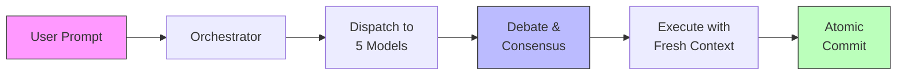

<objective>
Complete the README's deeper sections: add architecture diagram, community section, rebalance Getting Started, and fix broken Observability table.

Purpose: Deliver a README that is structurally correct, has visible architecture flow, community engagement CTAs, and an accessible Getting Started path -- closing all 4 remaining README structure requirements (RDME-05, RDME-08, RDME-09, RDME-10).

Output: Updated README.md with all deep sections fixed, plus test scaffolding to verify structural correctness.
</objective>

<execution_context>
@/Users/jonathanborduas/.claude/nf/workflows/execute-plan.md
@/Users/jonathanborduas/.claude/nf/templates/summary.md
</execution_context>

<context>
@.planning/ROADMAP.md
@.planning/REQUIREMENTS.md
@.planning/STATE.md
@.planning/phases/v0.32-02-readme-deep-sections/v0.32-02-RESEARCH.md
@README.md
</context>

<tasks>

<task type="auto">
  <name>Task 1: Create structural test scaffolding for README deep sections</name>
  <files>test/readme-deep-sections.test.cjs</files>
  <action>
Create `test/readme-deep-sections.test.cjs` using node:test and node:assert. The test file reads README.md and asserts structural properties for each requirement.

Tests to include (from RESEARCH.md validation architecture):

**RDME-05 (Architecture diagram):**
- README contains a `` ```mermaid `` fenced code block
- Mermaid block contains `flowchart LR` or `flowchart TD` directive
- Mermaid block appears after `## How It Works` heading and within 50 lines of it

**RDME-08 (Community section):**
- README has `## Community` heading
- Community section contains Discord invite link (`discord.gg/M8SevJEuZG`)
- `## Community` appears before `## Star History`

**RDME-09 (Getting Started rebalanced):**
- `npx @nforma.ai/nforma` install command appears after `## Getting Started` but before the first `<details>` within that section
- `/nf:mcp-setup` or quorum setup mention appears visible (outside `<details>`) in Getting Started section

**RDME-10 (Observability table fix):**
- No `![` image tag appears between `|...|` table rows in the Observability section
- `/nf:settings` and `/nf:set-profile` commands appear in the Observability table (inside `|...|` rows)

Use the exact test structure from RESEARCH.md section "Wave 0 Test Scaffolding". These tests will fail initially (RED state) since the README changes haven't been made yet.
  </action>
  <verify>Run `node --test test/readme-deep-sections.test.cjs 2>&1` -- tests for RDME-05, RDME-08 should fail (diagram and community section don't exist yet). RDME-09 may partially pass (install is already visible). RDME-10 should fail (broken table still present). Confirm the test file loads without syntax errors.</verify>
  <done>Test file exists at `test/readme-deep-sections.test.cjs`, runs without syntax errors, and contains assertions for all 4 requirements.</done>
</task>

<task type="auto">
  <name>Task 2: Implement all 4 README deep section changes</name>
  <files>README.md</files>
  <action>
Make four distinct edits to README.md, each addressing one requirement. Also update the nav bar to include the new Community section.

**RDME-05: Add Mermaid architecture diagram to "How It Works"**

Insert a Mermaid flowchart immediately after the `## How It Works` heading and before the blockquote that starts with "> **Already have code?**". Use `flowchart LR` (left-to-right) showing the nForma pipeline:



If styles cause rendering issues on GitHub, fall back to no styles. Keep it simple -- GitHub's Mermaid renderer may not support all CSS.

**RDME-08: Add Community section before Star History**

Insert a new `## Community` section immediately before `## Star History` (around line 918). Use this exact content:

```markdown
## Community

[](https://discord.gg/M8SevJEuZG)

**Get involved:**

- **Questions or ideas?** Start a [Discussion](https://github.com/nForma-AI/nForma/discussions)
- **Found a bug?** File an [Issue](https://github.com/nForma-AI/nForma/issues)
- **Want to contribute?** PRs welcome -- check out issues labeled [`good first issue`](https://github.com/nForma-AI/nForma/labels/good%20first%20issue)

All contributions are welcome.
```

**RDME-09: Rebalance Getting Started section**

The Getting Started section (starting around line 111) currently has the install command visible, followed by a `<details>` block for "Setting Up Your Quorum". Restructure so:

1. Install command stays visible (already is)
2. The runtime/location chooser paragraph stays visible (already is)
3. The "Verify with `/nf:help`" line stays visible (already is)
4. Extract the quorum setup wizard command (`/nf:mcp-setup`) and its 2-line description OUT of the `<details>` block into a visible `### Set Up Your Quorum` subsection showing just the wizard command and brief description
5. Keep the `<details>` for "Setting Up Your Quorum" but rename to "Manual Setup (Advanced)" and keep it collapsed -- it contains the manual CLI/API agent setup instructions
6. Keep "Agent Manager TUI", "Installation Options", and "Skip Permissions" as collapsed `<details>`

The critical path (install -> quorum setup wizard -> verify) must all be visible without clicking anything.

**RDME-10: Fix broken Observability table**

In the "Observability & Triage" `<details>` section (around lines 752-767):
1. Move the `` image from between table rows to AFTER the complete table
2. Move the two orphaned commands (`/nf:settings` and `/nf:set-profile`) back INTO the table as proper `| command | description |` rows BEFORE the image
3. The final table should have 7 command rows: health, observe, triage, solve, session-insights, settings, set-profile
4. The solve screenshot image appears after the closing table row

**Nav bar update:**

Update the nav bar (line 28) to include a `[Community](#community)` link. Place it between `[Configuration](#configuration-reference)` and `[Star History](#star-history)`.

Updated nav bar:
```
[Why nForma](#why-i-built-nforma) · [TUI](#terminal-ui) · [How It Works](#how-it-works) · [Features](#features) · [Commands](#commands) · [Configuration](#configuration-reference) · [Community](#community) · [Star History](#star-history) · [User Guide](docs/USER-GUIDE.md)
```
  </action>
  <verify>
1. Run `node --test test/readme-deep-sections.test.cjs` -- all tests must pass
2. Run `npm test` -- existing test suite must still pass (regression guard)
3. Verify with grep: `grep -c '## Community' README.md` returns 1
4. Verify with grep: `grep 'flowchart LR' README.md` returns a match
5. Verify with grep: `grep '\[Community\](#community)' README.md` returns a match (nav bar updated)
6. Verify the Observability table is intact: count `| \`/nf:` lines in the Observability section -- should be 7 command rows
  </verify>
  <done>
All 4 README deep section requirements are implemented:
- Mermaid architecture diagram visible in "How It Works" section
- Community section with Discord CTA appears before Star History
- Getting Started shows install, quorum setup wizard, and verify command visible by default
- Observability table renders correctly with all 7 commands and solve screenshot after the table
- Nav bar includes Community anchor link
- All structural tests pass
- Existing test suite passes
  </done>
</task>

</tasks>

<verification>
1. `node --test test/readme-deep-sections.test.cjs` -- all structural assertions pass
2. `npm test` -- full test suite regression check passes
3. Manual grep checks confirm:
   - Mermaid diagram in How It Works
   - Community section before Star History
   - Install + quorum setup visible in Getting Started
   - No image between table rows in Observability
   - Nav bar includes Community link
</verification>

<success_criteria>
- All 4 requirements (RDME-05, RDME-08, RDME-09, RDME-10) implemented and verified
- Test scaffolding validates structural correctness of all changes
- No regression in existing test suite
- README structure matches target from RESEARCH.md
</success_criteria>

<output>
After completion, create `.planning/phases/v0.32-02-readme-deep-sections/v0.32-02-01-SUMMARY.md`
</output>
