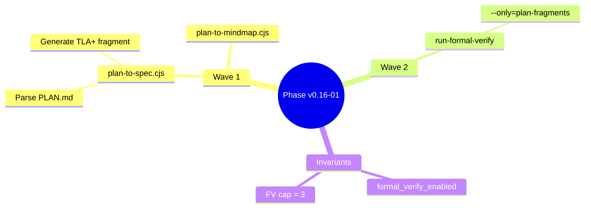

# Architecture Patterns

**Domain:** QGSD v0.16 — Formal Plan Verification integration with the plan-phase/quorum pipeline
**Researched:** 2026-02-26
**Confidence:** HIGH (all source files read directly; v0.14 and prior architecture verified from live code; no external APIs involved — pure in-repo integration analysis)

---

## Context: Subsequent Milestone on a Stable v0.14 Baseline

v0.14 shipped a fully wired formal verification pipeline: `run-formal-verify.cjs` (21-step parallel runner), `xstate-to-tla.cjs` (XState → TLA+ generation), `check-spec-sync.cjs` (AST drift detection in `npm test`), `generate-formal-specs.cjs` (XState → Alloy/PRISM generation), and `run-prism.cjs` with scoreboard rate injection.

This file answers the integration question for v0.16: **how do the 6 new features wire into the existing plan-phase → quorum pipeline?**

---

## Existing Architecture Baseline (v0.14 Stable)

```
plan-phase.md (workflow)
  │
  ├─ Step 5:  spawn qgsd-phase-researcher → writes RESEARCH.md
  ├─ Step 8:  spawn qgsd-planner → writes *-PLAN.md
  ├─ Step 8.5: run quorum inline (R3 dispatch, quorum.md protocol)
  │               │
  │               └─ quorum.md slot-worker YAML prompt:
  │                    slot, round, timeout_ms, repo_dir, mode, question,
  │                    artifact_path (PLAN.md path),
  │                    review_context
  ├─ Step 9:  handle planner return
  ├─ Step 10: spawn qgsd-plan-checker → verify
  ├─ Step 11: handle checker return
  └─ Step 12: revision loop (max 3 iterations)

quorum.md (inline dispatch protocol)
  │
  └─ slot-worker Task (parallel, model="haiku", max_turns=100)
       │
       └─ agents/qgsd-quorum-slot-worker.md
            parses YAML → reads artifact_path → calls call-quorum-slot.cjs
            returns structured result block with vote

bin/run-formal-verify.cjs
  │
  ├─ STEP 0:  xstate-to-tla.cjs → formal/tla/QGSDQuorum_xstate.tla
  ├─ STEP 1:  generate-formal-specs.cjs → Alloy + PRISM specs
  ├─ STEPS 2-3: petri net generation
  ├─ STEPS 4-11: TLA+ model checking (8 configs, parallel group)
  ├─ STEPS 12-18: Alloy structural verification (7 specs, parallel)
  └─ STEPS 19-20: PRISM probabilistic verification (2 specs, parallel)

Spec storage:
  formal/tla/       — TLA+ specs and TLC configs
  formal/alloy/     — Alloy .als files
  formal/prism/     — PRISM .pm/.props files
  formal/petri/     — Petri Net DOT/SVG files
  .planning/phases/<phase>/  — per-phase planning artifacts (PLAN.md, SUMMARY.md, etc.)
```

---

## Feature 1: Plan-to-Spec Pipeline (`bin/plan-to-spec.cjs`)

### What It Is

New binary that parses a PLAN.md and generates a formal spec fragment (TLA+ state machine sketch and/or Alloy predicate) representing the proposed state machine changes implied by the plan. Output is saved to `.planning/phases/<phase>/formal/`.

### Integration Seam

The seam is between **Step 8 (planner outputs PLAN.md)** and **Step 8.5 (quorum dispatch)** in `plan-phase.md`. A new **Step 8.3** must be inserted here. This is the only modification to `plan-phase.md` (or equivalently, to `qgsd-core/workflows/plan-phase.md`).

```
Step 8   → PLAN.md written by qgsd-planner
Step 8.3 → NEW: run plan-to-spec + run-formal-verify (Feature 2 loop)
Step 8.5 → quorum dispatch (gains formal_spec_summary + verification_result — Feature 4)
```

### New Files

| File | Type | Purpose |
|------|------|---------|
| `bin/plan-to-spec.cjs` | NEW | Parses PLAN.md → generates TLA+ fragment + Alloy predicates |
| `.planning/phases/<phase>/formal/` | NEW directory convention | Stores per-phase spec fragments |
| `.planning/phases/<phase>/formal/<phase>-plan-spec.tla` | NEW artifact | TLA+ sketch of plan's state changes |
| `.planning/phases/<phase>/formal/<phase>-plan-spec.als` | NEW artifact (optional) | Alloy predicate for structural invariants |

### Modified Files

| File | Change |
|------|--------|
| `qgsd-core/workflows/plan-phase.md` | Insert Step 8.3 after planner return, before quorum dispatch |

### Component Boundaries

`plan-to-spec.cjs` is a **stateless transformer**: takes a PLAN.md file path as input, writes spec fragments to the `formal/` subdirectory, exits with 0 on success or 1 on failure. It does not call any external tools — it generates spec text from PLAN.md content using template-based extraction.

The script must be self-contained CJS (no TypeScript, no new npm dependencies) following the zero-external-dep pattern of all other `bin/` scripts.

### What plan-to-spec Extracts

A PLAN.md describes tasks with state-modifying effects. The extractor needs to identify:

1. State variables touched (from `files_modified` frontmatter and task descriptions)
2. Transition preconditions (guards derived from task `depends_on` and wave ordering)
3. Invariants asserted in `must_haves` section

Output is a **spec fragment** (not a full verifiable spec). It is consumed by `run-formal-verify.cjs --only=plan-fragments` (Feature 2), which runs TLC/Alloy against it.

---

## Feature 2: Iterative Verification Loop

### What It Is

After `plan-to-spec` generates a fragment, a verification loop runs `run-formal-verify.cjs` against the fragment. If verification fails, the PLAN.md is sent back to the planner (revision loop). This continues until verification passes or a cap is hit.

### Integration Seam

This is the **iterative revision loop** inside the new Step 8.3. It reuses the existing `qgsd-planner` revision loop pattern from Step 12 but gates on formal verification failure rather than plan-checker issues.

```
Step 8.3 (new):
  iteration = 0
  loop:
    run plan-to-spec.cjs --plan ${PLAN_PATH} --out ${FORMAL_DIR}
    run run-formal-verify.cjs --only=plan-fragments --plan-dir ${FORMAL_DIR}
    if PASS or iteration >= FV_CAP: break
    spawn qgsd-planner (revision mode, reason=formal-verification-failure)
    iteration++
  on loop exit: record verification_result for Step 8.5
```

The cap (`FV_CAP`) is configurable via `workflow.formal_verify_cap` in `qgsd.json`. Default: 3 (same as the existing plan-checker iteration cap).

### Modified Files

| File | Change |
|------|--------|
| `qgsd-core/workflows/plan-phase.md` | New Step 8.3 with FV loop (same file as Feature 1) |
| `bin/run-formal-verify.cjs` | Add `--plan-dir` flag and `plan-fragments` tool group |

### New run-formal-verify Step

A new tool group `plan-fragments` is added to `run-formal-verify.cjs`:

```javascript
{ tool: 'plan', id: 'plan:tla-fragment', label: 'TLA+ plan fragment check',
  type: 'node', script: 'run-tlc.cjs', args: ['MC<phase>-plan'] }
```

This step runs only when `--only=plan-fragments` is passed and a generated `.cfg` file exists in the `formal/` subdirectory. The step is skipped gracefully if no fragment was generated (plan-to-spec returned failure).

### Config Key

```json
// .claude/qgsd.json
{
  "workflow": {
    "formal_verify_enabled": true,
    "formal_verify_cap": 3
  }
}
```

The `formal_verify_enabled` flag follows the same pattern as `research_enabled` and `plan_checker_enabled` — read during `gsd-tools.cjs init plan-phase` and returned in the INIT JSON.

### Modified Files (gsd-tools)

| File | Change |
|------|--------|
| `bin/gsd-tools.cjs` (or installed equivalent) | Add `formal_verify_enabled` and `formal_verify_cap` to `init plan-phase` INIT JSON output |

---

## Feature 3: Mind Map Generation (`bin/plan-to-mindmap.cjs`)

### What It Is

New binary that parses a PLAN.md and generates a Mermaid `mindmap` diagram. Output is saved to `.planning/phases/<phase>/MINDMAP.md`.

### Integration Seam

Mind map generation runs **concurrently with plan-to-spec** inside the new Step 8.3. Both are file transformers with no external tool dependencies — they can run as sequential `spawnSync` calls (fast enough, no parallelism needed given each is <100ms).

```
Step 8.3:
  spawnSync plan-to-spec.cjs       → formal/ spec fragment
  spawnSync plan-to-mindmap.cjs    → MINDMAP.md
  [run FV loop...]
  [read verification_result for Step 8.5]
```

### New Files

| File | Type | Purpose |
|------|------|---------|
| `bin/plan-to-mindmap.cjs` | NEW | PLAN.md → Mermaid mindmap |
| `.planning/phases/<phase>/MINDMAP.md` | NEW artifact | Per-phase visual plan summary |

### No workflow.md Modification Required (for generation)

The mind map generation step runs inside Step 8.3, which is already being added for Feature 1. No additional modification to `plan-phase.md` is needed beyond what Feature 1 requires.

### Mermaid mindmap Output Format

```markdown
# Phase v0.16-01 Plan Mind Map


```

The MINDMAP.md is also injected into the quorum slot-worker prompt (Feature 4).

---

## Feature 4: Quorum Formal Context Injection

### What It Is

The quorum.md slot-worker YAML prompt gains two new optional fields: `formal_spec_summary` and `verification_result`. These give quorum agents mathematical evidence alongside the plan artifact.

### Integration Seam

The integration point is in **Step 8.5** of `plan-phase.md`, where the quorum dispatch is constructed. After the FV loop completes, the orchestrator has:
- `verification_result` (PASS / FAIL / SKIP — from run-formal-verify exit code)
- `formal_spec_summary` (brief text extracted from the spec fragment, e.g., invariants and transitions named)
- path to `MINDMAP.md` (generated in Step 8.3)

These are passed into the quorum slot-worker YAML prompt:

```yaml
slot: gemini-1
round: 1
timeout_ms: 30000
repo_dir: /Users/jonathanborduas/code/QGSD
mode: A
question: Approve or block this plan?
artifact_path: .planning/phases/v0.16-01/v0.16-01-01-PLAN.md
review_context: This is a pre-execution implementation plan. Evaluate approach and completeness.
mindmap_path: .planning/phases/v0.16-01/MINDMAP.md
formal_spec_summary: |
  TLA+ fragment: 3 transitions (GenerateSpec, RunVerify, ReviseOnFail).
  Invariants: FVCapBounded (iterations ≤ 3), SpecGeneratedBeforeVerify.
  All invariants passed TLC check.
verification_result: PASS
```

### Modified Files

| File | Change |
|------|--------|
| `qgsd-core/workflows/plan-phase.md` | Step 8.5 quorum dispatch includes formal_spec_summary + verification_result + mindmap_path (same file as Features 1-2) |
| `agents/qgsd-quorum-slot-worker.md` | Add parsing of `formal_spec_summary`, `verification_result`, `mindmap_path` optional fields; inject into model prompt if present |

### Slot-Worker Prompt Addition

In the slot-worker's Mode A prompt template (Step 3 of `agents/qgsd-quorum-slot-worker.md`), after the artifact content:

```
[If formal_spec_summary present:]
=== Formal Verification Summary ===
Verification result: <verification_result>
<formal_spec_summary verbatim>
================

[If mindmap_path present:]
=== Plan Mind Map ===
<read mindmap_path and embed content>
=================
```

The slot-worker reads `mindmap_path` using its Read tool (consistent with how it reads `artifact_path`).

### No Changes to quorum.md

`quorum.md` defines the _protocol_ (provider pre-flight, team capture, Mode A/B dispatch, deliberation). The new fields are in the slot-worker YAML block, which `plan-phase.md` constructs. `quorum.md` already specifies that the slot-worker YAML is extensible — new optional fields pass through transparently. The slot-worker agent definition (`agents/qgsd-quorum-slot-worker.md`) is what needs updating to declare and use the new fields.

---

## Feature 5: QGSD Self-Application — Code → All Specs via JSDoc

### What It Is

Extend `xstate-to-tla.cjs` and `generate-formal-specs.cjs` to also read JSDoc annotations (`@invariant`, `@transition`, `@probability`) from QGSD's own source files (hooks, bin scripts) and fold them into the generated specs.

### Integration Seam

This feature is entirely within the existing `bin/generate-formal-specs.cjs` and `bin/xstate-to-tla.cjs` scripts. It does not touch `plan-phase.md`, `quorum.md`, or any workflow file.

The seam is the **spec generation step** (`STEPS[0]` and `STEPS[1]`) in `run-formal-verify.cjs`. After this feature ships, the generated specs will be richer — more invariants and transitions — but the runner itself does not change.

### Modified Files

| File | Change |
|------|--------|
| `bin/xstate-to-tla.cjs` | Add JSDoc annotation extraction pass: read `@invariant`, `@transition` from annotated source files; append to generated TLA+ spec |
| `bin/generate-formal-specs.cjs` | Add `@probability` extraction for PRISM transition weights; add `@invariant`/`@transition` for Alloy predicates |
| `bin/check-spec-sync.cjs` | Extend drift detection: Check 6 — annotated `@invariant` names in source files must have corresponding invariant definitions in TLA+ spec |

### JSDoc Annotation Format

```javascript
// hooks/qgsd-stop.js

/**
 * Evaluates the quorum gate on a planning turn.
 *
 * @invariant NoSkipQuorum — outcome is always 'allow' or 'block', never undefined
 * @transition QUORUM_VERDICT — fires after gate evaluation with outcome field
 */
function evaluateGate(transcript) { ... }

// bin/run-prism.cjs

/**
 * Computes TP rate for PRISM model.
 *
 * @probability consensus_rate — P(consensus within 3 rounds) >= 0.95
 */
function readScoreboardRates() { ... }
```

The annotation format uses JSDoc-style `@tag name — description` on a single line. Extraction is regex-based (consistent with `generate-formal-specs.cjs`'s existing approach of regex over the XState machine source).

### New Spec Sections

`xstate-to-tla.cjs` emits a new section in the generated `QGSDQuorum_xstate.tla`:

```tla
\* ── Annotations from JSDoc (@invariant) ──────────────────
\* These are extracted from source files at generation time.
\* Source: hooks/qgsd-stop.js
NoSkipQuorum == outcome \in {"allow", "block"}

\* Source: hooks/qgsd-prompt.js
PhaseCommandIsPlanning == matchedCommand \in PLANNING_COMMANDS
```

This maintains the `_xstate.tla` separation from the hand-authored `QGSDQuorum.tla` — generated annotations go into the `_xstate` file, not the canonical spec.

### Test Impact

`bin/xstate-to-tla.test.cjs` and `bin/check-spec-sync.test.cjs` need new test cases covering the annotation extraction path.

---

## Feature 6: General-Purpose Code → Spec for User Projects

### What It Is

Expose the code → spec pipeline for any project using QGSD (not just QGSD itself). A new config key `formal_spec.enabled` + `formal_spec.source_dirs` in `.claude/qgsd.json` enables annotation scanning for user project source files.

### Integration Seam

This is a **configuration extension** to the existing `bin/run-formal-verify.cjs` and `bin/generate-formal-specs.cjs`. The seam is:

1. `generate-formal-specs.cjs` currently hardcodes `src/machines/qgsd-workflow.machine.ts` as input
2. With this feature, it reads `formal_spec.source_dirs` from config and scans those directories for JSDoc annotations
3. Generated specs are written to a project-local `formal/` directory (not QGSD's own `formal/`)

### Modified Files

| File | Change |
|------|--------|
| `bin/generate-formal-specs.cjs` | Read `formal_spec.source_dirs` from config; scan dirs for `@invariant`/`@transition`/`@probability`; write to project `formal/` dir |
| `bin/run-formal-verify.cjs` | Add `--project-dir` flag: when set, reads from project's `formal/` instead of QGSD's `formal/` |
| `bin/gsd-tools.cjs` | Add `formal-spec-init` subcommand: scaffolds `formal/` directory in current project |

### New Config Key

```json
// .claude/qgsd.json (project-level)
{
  "formal_spec": {
    "enabled": true,
    "source_dirs": ["src", "lib"],
    "out_dir": "formal"
  }
}
```

The `formal_spec.enabled` key follows the existing two-layer config pattern (project config shallow-merges over global config per `config-loader.js`). When `enabled` is false (or absent), the pipeline is a no-op for the user project — QGSD's own pipeline is unaffected.

### Isolation Invariant

QGSD's self-verification (`formal/tla/`, `formal/alloy/`, etc.) and a user project's generated specs are **completely separate file trees**. The runner detects which to use via the `--project-dir` flag. There is no shared state.

---

## Complete System Architecture — v0.16

```
plan-phase.md (workflow) — Modified
  │
  ├─ Step 5:  qgsd-phase-researcher → RESEARCH.md (unchanged)
  ├─ Step 8:  qgsd-planner → *-PLAN.md (unchanged)
  │
  ├─ Step 8.3: NEW — Plan Formal Verification Loop
  │     │
  │     ├─ bin/plan-to-spec.cjs                              [NEW]
  │     │     input:  .planning/phases/<ph>/*-PLAN.md
  │     │     output: .planning/phases/<ph>/formal/<ph>-plan-spec.tla
  │     │             .planning/phases/<ph>/formal/MC<ph>-plan.cfg
  │     │
  │     ├─ bin/plan-to-mindmap.cjs                           [NEW]
  │     │     input:  .planning/phases/<ph>/*-PLAN.md
  │     │     output: .planning/phases/<ph>/MINDMAP.md
  │     │
  │     ├─ bin/run-formal-verify.cjs --only=plan-fragments   [MODIFIED]
  │     │     reads: .planning/phases/<ph>/formal/
  │     │     exits 0 (PASS) or 1 (FAIL)
  │     │
  │     └─ [on FAIL, iteration < FV_CAP]:
  │           spawn qgsd-planner (revision, reason=fv-failure)
  │           loop back to plan-to-spec
  │
  ├─ Step 8.5: Quorum dispatch — Modified
  │     quorum slot-worker YAML gains:                       [MODIFIED]
  │       formal_spec_summary: "<extracted invariant names>"
  │       verification_result: PASS | FAIL | SKIP
  │       mindmap_path: ".planning/phases/<ph>/MINDMAP.md"
  │     │
  │     └─ agents/qgsd-quorum-slot-worker.md                 [MODIFIED]
  │           reads mindmap_path via Read tool
  │           injects formal_spec_summary + verification_result into model prompt
  │
  ├─ Step 9:  handle planner return (unchanged)
  ├─ Step 10: qgsd-plan-checker (unchanged)
  ├─ Step 11: handle checker return (unchanged)
  └─ Step 12: revision loop (unchanged)

Code → All Specs (Feature 5 + 6):
  bin/xstate-to-tla.cjs              [MODIFIED — add @invariant/@transition extraction]
  bin/generate-formal-specs.cjs      [MODIFIED — add @probability + project mode]
  bin/check-spec-sync.cjs            [MODIFIED — Check 6: annotation drift]
  bin/run-formal-verify.cjs          [MODIFIED — --project-dir flag]
```

---

## Component Boundaries

| Component | Responsibility | Communicates With |
|-----------|----------------|-------------------|
| `bin/plan-to-spec.cjs` | PLAN.md → TLA+/Alloy fragment (text transform only) | `run-formal-verify.cjs` (writes files; runner reads them) |
| `bin/plan-to-mindmap.cjs` | PLAN.md → Mermaid mindmap (text transform only) | `plan-phase.md` (path passed to quorum dispatch) |
| `plan-phase.md` Step 8.3 | Orchestrates FV loop: spec generation, verification, revision | `plan-to-spec.cjs`, `plan-to-mindmap.cjs`, `run-formal-verify.cjs`, `qgsd-planner` |
| `run-formal-verify.cjs` | Runs tool groups; added `plan-fragments` group for per-phase specs | `plan-to-spec.cjs` (reads output), TLC/Alloy/PRISM (invokes) |
| `agents/qgsd-quorum-slot-worker.md` | Builds per-slot model prompt; now injects formal context | `plan-phase.md` (receives YAML fields), `call-quorum-slot.cjs` |
| `bin/xstate-to-tla.cjs` | XState machine + JSDoc annotations → TLA+ spec | `run-formal-verify.cjs` (step 0), `check-spec-sync.cjs` |
| `bin/generate-formal-specs.cjs` | XState + JSDoc @probability → Alloy + PRISM; project mode | `run-formal-verify.cjs` (step 1) |
| `bin/check-spec-sync.cjs` | Drift detection; extended with annotation Check 6 | `npm test` (called by test suite) |
| `bin/gsd-tools.cjs` | Returns `formal_verify_enabled` + `formal_verify_cap` in INIT JSON | `plan-phase.md` (reads flags at Step 1) |

---

## Data Flow — v0.16 Plan-Phase Pipeline

```
1. User runs /qgsd:plan-phase v0.16-01
       │
2. Step 8: qgsd-planner writes
       .planning/phases/v0.16-01-<slug>/v0.16-01-01-PLAN.md
       │
3. Step 8.3 — FV Loop (NEW):
       │
       ├─ plan-to-spec.cjs reads PLAN.md
       │     → writes formal/v0.16-01-plan-spec.tla
       │     → writes formal/MCv0.16-01-plan.cfg
       │
       ├─ plan-to-mindmap.cjs reads PLAN.md
       │     → writes MINDMAP.md
       │
       ├─ run-formal-verify.cjs --only=plan-fragments
       │     → TLC reads formal/MCv0.16-01-plan.cfg
       │     → exits 0 (PASS) or 1 (FAIL)
       │
       └─ [on FAIL, iteration < 3]:
             spawn qgsd-planner --revision --reason=fv-failure
             goto plan-to-spec.cjs
       │
4. Step 8.5 — Quorum dispatch:
       slot-worker YAML includes:
         artifact_path: ...v0.16-01-01-PLAN.md
         mindmap_path: ...MINDMAP.md
         formal_spec_summary: "3 transitions. Invariants: FVCapBounded, SpecFirst. TLC: PASS"
         verification_result: PASS
       │
       └─ slot-worker reads artifact_path + mindmap_path + embeds formal context
            → model receives: PLAN.md + mind map + verification proof + question
            → returns APPROVE/BLOCK with mathematical grounding
       │
5. Consensus → commit PLAN.md + MINDMAP.md + formal/ fragment together
```

---

## New vs. Modified Files — Complete Inventory

### New Files

| File | Purpose |
|------|---------|
| `bin/plan-to-spec.cjs` | PLAN.md parser + TLA+/Alloy fragment generator |
| `bin/plan-to-spec.test.cjs` | Unit tests for spec generation from fixture PLAN.md files |
| `bin/plan-to-mindmap.cjs` | PLAN.md → Mermaid mindmap generator |
| `bin/plan-to-mindmap.test.cjs` | Unit tests for mindmap generation |
| `.planning/phases/<phase>/formal/` | Per-phase directory convention for FV fragments (created at runtime) |

### Modified Files

| File | What Changes |
|------|-------------|
| `qgsd-core/workflows/plan-phase.md` | Insert Step 8.3 (FV loop) and update Step 8.5 (add formal context to quorum YAML) |
| `agents/qgsd-quorum-slot-worker.md` | Add `formal_spec_summary`, `verification_result`, `mindmap_path` optional field parsing; inject into model prompt |
| `bin/run-formal-verify.cjs` | Add `plan-fragments` tool group; add `--plan-dir` flag (Feature 6) |
| `bin/xstate-to-tla.cjs` | Add `@invariant` + `@transition` JSDoc extraction pass (Feature 5) |
| `bin/generate-formal-specs.cjs` | Add `@probability` extraction; add `--project-dir` flag for project mode (Features 5, 6) |
| `bin/check-spec-sync.cjs` | Add Check 6: `@invariant` annotations in source must have TLA+ counterparts |
| `bin/gsd-tools.cjs` | Add `formal_verify_enabled`, `formal_verify_cap` to `init plan-phase` INIT JSON |
| `bin/xstate-to-tla.test.cjs` | New test cases for annotation extraction |
| `bin/check-spec-sync.test.cjs` | New test cases for Check 6 |
| `bin/install.js` | Sync `plan-to-spec.cjs` and `plan-to-mindmap.cjs` to `~/.claude/qgsd-bin/` (install distribution) |

### NOT Modified (architectural constraint)

| File | Why Not Modified |
|------|-----------------|
| `commands/qgsd/quorum.md` | Protocol definition unchanged; new fields flow via slot-worker YAML which plan-phase.md constructs |
| `hooks/qgsd-prompt.js` | No new hook-level behavior needed |
| `hooks/qgsd-stop.js` | No new gate behavior needed |
| `hooks/qgsd-circuit-breaker.js` | No new breaker logic needed |
| `agents/qgsd-planner.md` | Planner behavior unchanged; FV-driven revision uses existing revision interface |
| `agents/qgsd-plan-checker.md` | Plan checker role unchanged |
| `bin/update-scoreboard.cjs` | Scoreboard schema unchanged |

---

## Build Order (Dependency Graph)

The 6 features have strict dependencies. The correct build order is:

```
Phase 1 — plan-to-spec.cjs + plan-to-mindmap.cjs (independent transforms)
  1a. bin/plan-to-spec.cjs (NEW) — PLAN.md → TLA+ fragment
  1b. bin/plan-to-spec.test.cjs — fixture-based unit tests
  1c. bin/plan-to-mindmap.cjs (NEW) — PLAN.md → Mermaid mindmap
  1d. bin/plan-to-mindmap.test.cjs — fixture-based unit tests

  Why first: Features 2, 3, 4 all depend on these two scripts.
  They have no dependencies themselves — pure text transforms.

Phase 2 — run-formal-verify.cjs plan-fragments extension
  2a. Add plan-fragments tool group to run-formal-verify.cjs
  2b. Add --plan-dir flag
  2c. Extend run-formal-verify.test.cjs with plan-fragments tests

  Why second: Depends on plan-to-spec.cjs output (Phase 1).
  The --plan-dir extension (Feature 6) is done here too since it touches the same file.

Phase 3 — plan-phase.md integration (Step 8.3 + Step 8.5)
  3a. Insert Step 8.3 into qgsd-core/workflows/plan-phase.md
       (calls plan-to-spec, plan-to-mindmap, run-formal-verify FV loop)
  3b. Update Step 8.5 quorum dispatch to include formal context fields
  3c. Install sync: node bin/install.js --claude --global (Step 3b modifies installed workflow)

  Why third: Depends on both plan-to-spec (Phase 1) and run-formal-verify extension (Phase 2).
  This phase wires the new tools into the actual plan-phase workflow.

Phase 4 — Quorum formal context (slot-worker prompt injection)
  4a. Update agents/qgsd-quorum-slot-worker.md to parse new YAML fields
  4b. Test by running a plan-phase against a test phase to verify formal context appears in quorum

  Why fourth: Depends on Phase 3 (plan-phase.md must produce the new YAML fields).
  Slot-worker change is small (optional field parsing) — after Phase 3 is stable.

Phase 5 — JSDoc annotation extraction (xstate-to-tla + generate-formal-specs)
  5a. Extend xstate-to-tla.cjs with @invariant/@transition pass
  5b. Extend generate-formal-specs.cjs with @probability pass
  5c. Extend check-spec-sync.cjs with Check 6
  5d. Add tests in xstate-to-tla.test.cjs and check-spec-sync.test.cjs

  Why fifth: Entirely independent of Phases 1-4 (different code paths).
  But placed here because it modifies existing FV scripts that Phase 2 also touches —
  doing Phase 2 first reduces merge surface.

Phase 6 — General-purpose project mode
  6a. Add formal_spec.enabled / source_dirs to config-loader validation
  6b. gsd-tools.cjs formal-spec-init subcommand
  6c. Integration test: run plan-to-spec + run-formal-verify against a non-QGSD fixture project

  Why last: Depends on all prior phases (Phase 2 for --project-dir, Phase 5 for annotation
  extraction). Also the most ambiguous feature (project structure varies) — implementing last
  means the pipeline is proven first against QGSD's own structure.
```

### Dependency Summary

```
Phase 1 (plan-to-spec, plan-to-mindmap)
  ↓
Phase 2 (run-formal-verify extension)
  ↓
Phase 3 (plan-phase.md Step 8.3 + 8.5)
  ↓
Phase 4 (slot-worker formal context)

Phase 5 (JSDoc annotations)    ← independent of Phases 3-4, depends on Phase 1 only for
                                   shared script files (xstate-to-tla, generate-formal-specs)

Phase 6 (project mode)         ← depends on Phases 2 + 5
```

Phases 3-4 can be split into separate QGSD phases with wave assignment. Phases 5 and 6 are independent tracks and can run in parallel with Phases 3-4.

---

## Architectural Patterns to Follow

### Pattern 1: Step Insertion vs. Workflow Rewrite

**What:** Insert Step 8.3 between Steps 8 and 8.5 in `plan-phase.md`. Do not restructure the surrounding steps.

**Why:** Steps 8.5 (quorum), 9 (planner return), 10 (checker), 11 (checker return), and 12 (revision loop) are all correct and tested. Inserting a single new step is the minimum viable change — it avoids touching the revision loop logic or the offer_next/auto-advance machinery.

**Implementation note:** The FV loop in Step 8.3 should explicitly call `activity-set` with `sub_activity: "formal_verification"` (consistent with the existing pattern of activity tracking for every major sub-step in plan-phase).

### Pattern 2: YAML Field Extension (Additive Only)

**What:** New fields (`formal_spec_summary`, `verification_result`, `mindmap_path`) are added to the quorum YAML block. They are optional — if absent, the slot-worker behaves exactly as before.

**Why:** This is how the existing `artifact_path`, `review_context`, `skip_context_reads`, and `prior_positions` fields work. The slot-worker already has conditional logic for each. Following this pattern means zero regression risk for the existing quorum protocol.

**Implementation note:** In `agents/qgsd-quorum-slot-worker.md`, the new fields go in the "Optional fields" block at Step 1.

### Pattern 3: spec Fragment is a Separate File From Canonical Specs

**What:** Per-phase spec fragments (`formal/<phase>-plan-spec.tla`) are never merged into `formal/tla/QGSDQuorum.tla` or any other canonical spec.

**Why:** The `_xstate.tla` / canonical separation established in v0.14 (BROKEN-01 fix) must be preserved. Generated plan fragments belong to the plan artifact lifecycle, not the verified spec lifecycle. They are ephemeral — valid during the plan-phase workflow and then archived with the phase.

**Implementation note:** The `plan-fragments` tool group in `run-formal-verify.cjs` must never write to `formal/tla/` — only read from `.planning/phases/<phase>/formal/`.

### Pattern 4: Config Gate Before Every New Tool Invocation

**What:** The FV loop in Step 8.3 is gated on `formal_verify_enabled` from the INIT JSON. If false, Step 8.3 is skipped entirely.

**Why:** `research_enabled` and `plan_checker_enabled` both follow this pattern. Users who need faster plan-phase runs (CI environments, gap-closure phases) can disable FV without modifying the workflow.

**Implementation note:** The `--skip-fv` flag should also disable Step 8.3, following the `--skip-research` pattern.

---

## Anti-Patterns to Avoid

### Anti-Pattern 1: Running Full run-formal-verify in the Plan Loop

**What goes wrong:** Running all 21 steps of `run-formal-verify.cjs` for each PLAN.md revision adds 2+ minutes per iteration (TLC model checking is slow even when parallelized).

**Why it's wrong:** The plan-phase loop is synchronous in the orchestrator context. 3 iterations × 2 min = 6+ minutes of blocking verification before quorum even runs. This defeats the fail-fast purpose of the loop.

**Instead:** Use `--only=plan-fragments` which runs only the new plan-specific TLC check against the lightweight fragment. Full pipeline verification remains a CI step.

### Anti-Pattern 2: Writing Fragment to formal/tla/ or formal/alloy/

**What goes wrong:** Fragment gets picked up by full pipeline runs; mismatches against canonical specs trigger false drift alarms.

**Why it's wrong:** Fragments model a single phase's proposed changes — they are underspecified relative to the full system. The full TLC safety/liveness checks would reject them as incomplete.

**Instead:** Fragments go to `.planning/phases/<phase>/formal/` only. The `plan-fragments` tool group in run-formal-verify is scoped to that directory.

### Anti-Pattern 3: Blocking plan-phase on Mindmap or Spec Generation Failure

**What goes wrong:** If `plan-to-spec.cjs` or `plan-to-mindmap.cjs` fails (e.g., malformed PLAN.md frontmatter), Step 8.3 treats it as a hard failure and blocks the workflow.

**Why it's wrong:** These are value-add artifacts. A failed spec generation should not prevent quorum from running on a valid plan. The plan artifact is the authoritative artifact — not the spec fragment.

**Instead:** On `plan-to-spec.cjs` failure, log a warning and set `verification_result: SKIP`. On `plan-to-mindmap.cjs` failure, omit `mindmap_path` from the quorum YAML. Proceed to quorum with degraded (but not blocked) context. This follows the existing fail-open R6 philosophy.

### Anti-Pattern 4: Deep-Merging formal_spec Config

**What goes wrong:** Using deep merge for `formal_spec` config means a project config adding `formal_spec.enabled: true` also inherits any global `formal_spec.source_dirs` the user happened to set, potentially scanning wrong directories.

**Why it's wrong:** `config-loader.js` uses shallow merge (project values replace global values) as an intentional design decision (Key Decision table in PROJECT.md: "shallow merge for config layering").

**Instead:** `formal_spec` is a top-level key subject to shallow merge. If a project config defines `formal_spec: { enabled: true }`, the global `formal_spec` block is completely replaced. Users must provide all keys they want in the project config.

---

## Scalability Considerations

| Concern | Per plan-phase run | At 10 phases | At 100 phases |
|---------|-------------------|--------------|---------------|
| plan-to-spec.cjs runtime | <500ms (pure text transform) | negligible | negligible |
| plan-to-mindmap.cjs runtime | <200ms | negligible | negligible |
| TLC plan-fragment check | ~5-30s (small fragment model) | 5-30s per phase | 5-30s per phase (independent) |
| Fragment storage per phase | ~5-20KB | ~200KB total | ~2MB total |
| MINDMAP.md per phase | ~2-5KB | ~50KB total | ~500KB total |
| Quorum slot-worker context overhead | +500 bytes (summary text) | unchanged per round | unchanged per round |

The formal spec fragments are per-phase artifacts stored under `.planning/phases/` — they are small and independent. There is no cumulative performance degradation.

---

## Integration Points Summary Table

### Existing Files — Change Type

| File | Change Type | What Changes |
|------|-------------|--------------|
| `qgsd-core/workflows/plan-phase.md` | Modified | Insert Step 8.3 (FV loop); update Step 8.5 (add formal context fields to quorum YAML) |
| `agents/qgsd-quorum-slot-worker.md` | Modified | Add 3 new optional field parsers; inject into Mode A prompt |
| `bin/run-formal-verify.cjs` | Modified | Add `plan-fragments` tool group; add `--plan-dir` flag |
| `bin/xstate-to-tla.cjs` | Modified | Add JSDoc `@invariant`/`@transition` extraction pass |
| `bin/generate-formal-specs.cjs` | Modified | Add `@probability` extraction; add `--project-dir` project mode |
| `bin/check-spec-sync.cjs` | Modified | Add Check 6: annotation-to-spec drift |
| `bin/gsd-tools.cjs` | Modified | Add `formal_verify_enabled` + `formal_verify_cap` to `init plan-phase` INIT JSON |
| `bin/install.js` | Modified | Add `plan-to-spec.cjs` + `plan-to-mindmap.cjs` to install distribution list |
| `bin/xstate-to-tla.test.cjs` | Modified | New annotation extraction test cases |
| `bin/check-spec-sync.test.cjs` | Modified | New Check 6 test cases |
| `bin/run-formal-verify.test.cjs` | Modified | New `plan-fragments` test cases |

### New Files

| File | Purpose |
|------|---------|
| `bin/plan-to-spec.cjs` | PLAN.md → TLA+/Alloy fragment generator |
| `bin/plan-to-spec.test.cjs` | Unit tests (fixture-based) |
| `bin/plan-to-mindmap.cjs` | PLAN.md → Mermaid mindmap |
| `bin/plan-to-mindmap.test.cjs` | Unit tests |

---

## Sources

- Live source reads: `qgsd-core/workflows/plan-phase.md`, `commands/qgsd/quorum.md`, `agents/qgsd-quorum-slot-worker.md`, `bin/run-formal-verify.cjs`, `bin/xstate-to-tla.cjs`, `bin/generate-formal-specs.cjs`, `bin/check-spec-sync.cjs`, `bin/run-prism.cjs`, `.planning/PROJECT.md`, `.planning/ROADMAP.md`, `.planning/STATE.md`
- Prior architecture research: `.planning/research/ARCHITECTURE.md` (v0.12 baseline, 2026-02-24)
- v0.14 architectural decisions: Key Decisions table in `.planning/PROJECT.md` (BROKEN-01 _xstate suffix, esbuild inline bundling, TLA+ orphan phases as fail)
- Config system: `bin/gsd-tools.cjs` INIT JSON pattern; `config-loader.js` shallow-merge semantics (Key Decisions: "shallow merge for config layering")
- Activity tracking: `activity-set` sub_activity pattern from `plan-phase.md` Steps 5, 8, 8.5

---

*Architecture research for: QGSD v0.16 Formal Plan Verification*
*Researched: 2026-02-26*
