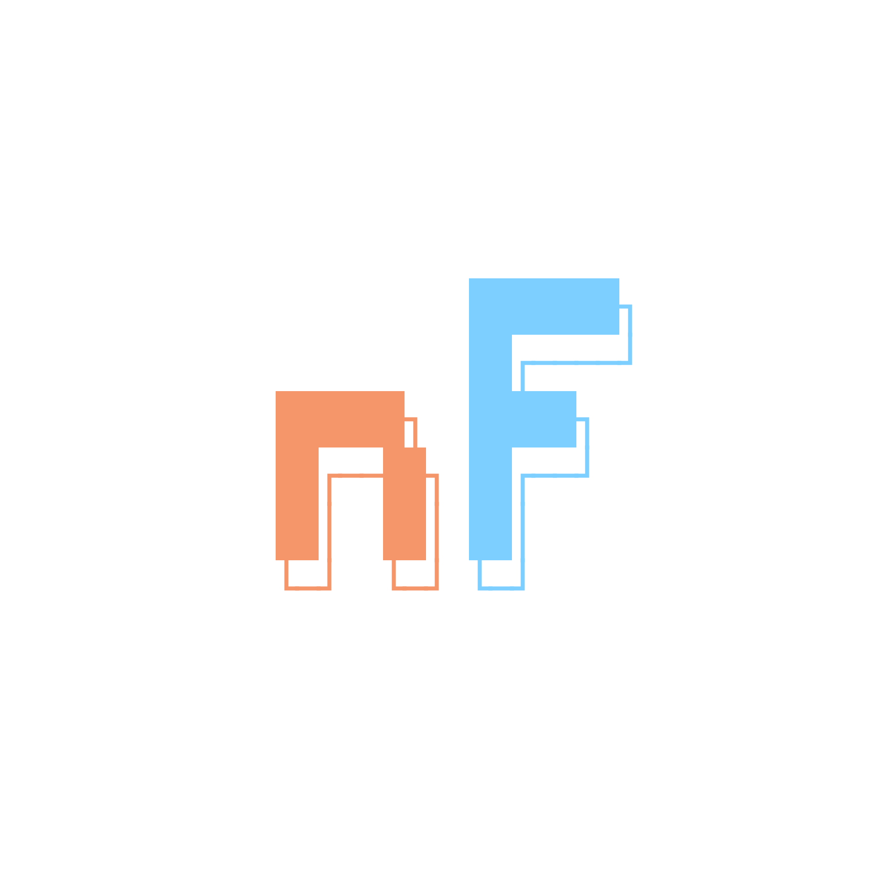
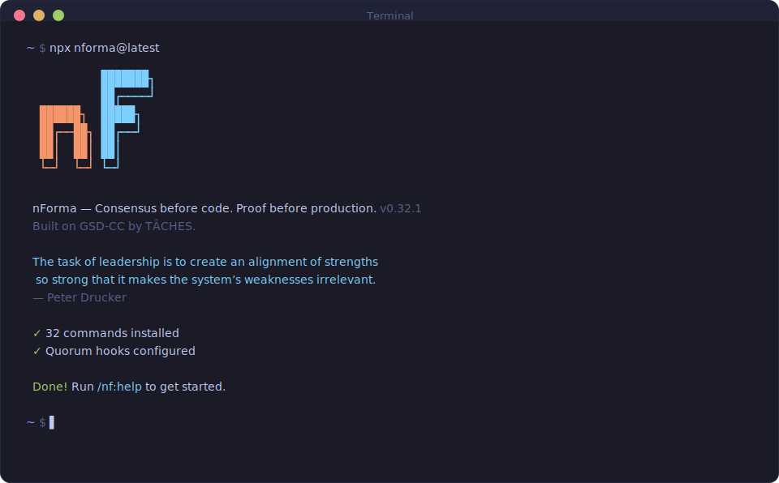
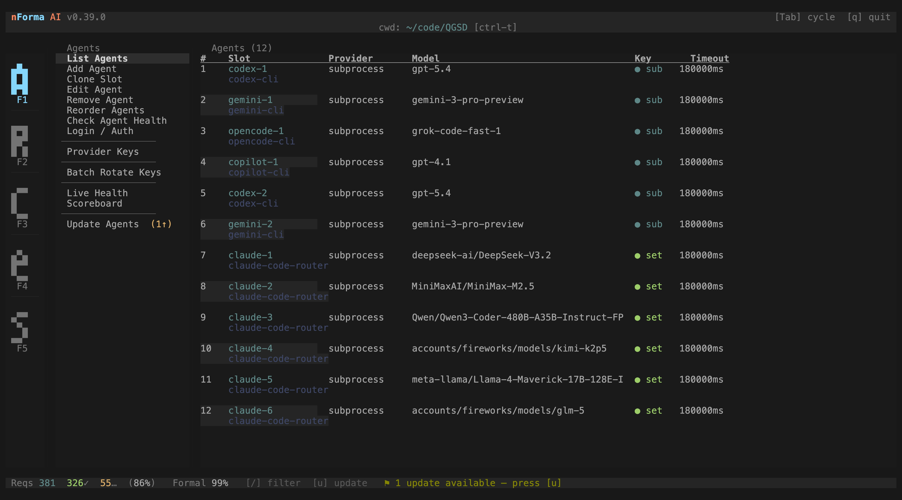
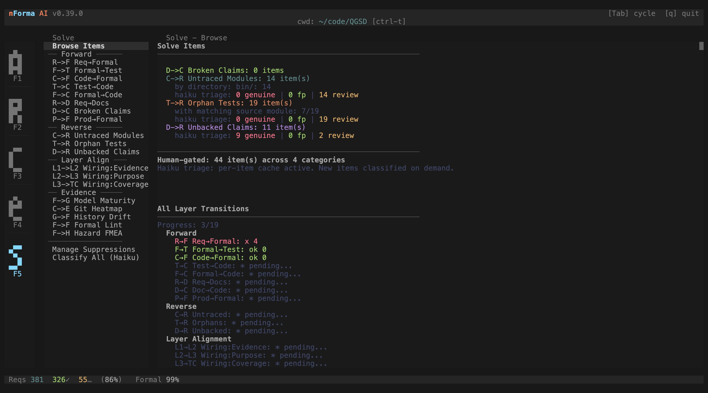
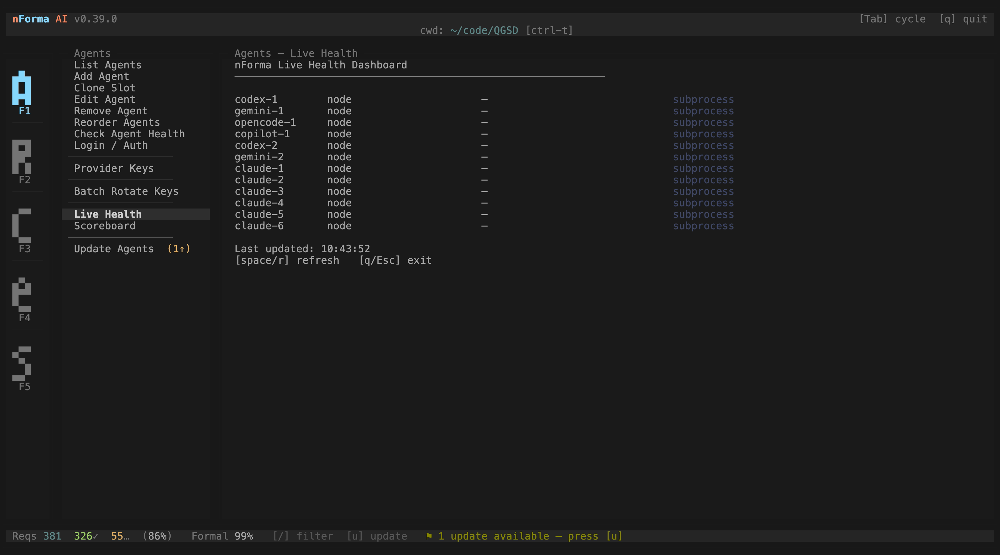
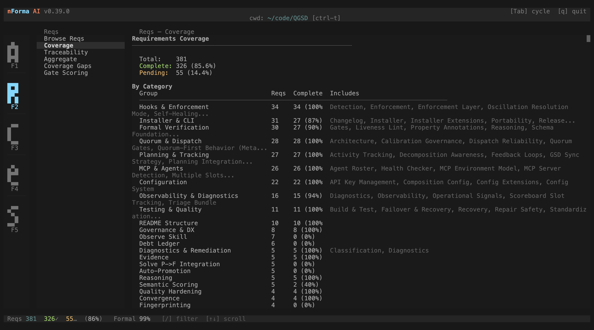
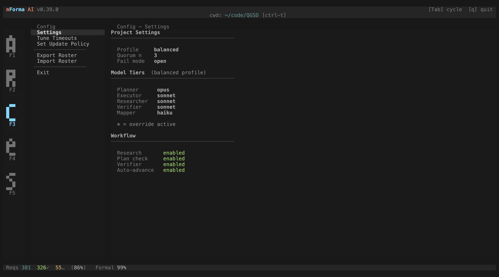

<div align="center">



# nForma — Consensus before code. Proof before production.

**nForma orchestrates a quorum of diverse coding agents that debate a plan until they reach full consensus.<br>Then formal methods turn requirements into invariants and simulate the system ahead of time.<br>The result: fewer hallucinations, fewer blind spots, and systems designed to survive the future.**

[](https://www.npmjs.com/package/@nforma.ai/nforma)
[](https://www.npmjs.com/package/@nforma.ai/nforma)
[](https://discord.gg/M8SevJEuZG)
[](https://x.com/JonathanBorduas)
[](https://github.com/nForma-AI/nForma)
[](https://nforma.ai)
[](https://github.com/nForma-AI/nForma/actions/workflows/formal-verify.yml)
[](LICENSE)

<br>

```bash
npx @nforma.ai/nforma@latest
```

Prerelease: `npx @nforma.ai/nforma@next` · Optional: `npm install @huggingface/transformers` ([why?](#getting-started))

**Requires Node.js 18+. Works on macOS and Linux.**

<br>



<br>

[Why nForma](#why-i-built-nforma) · [TUI](#terminal-ui) · [How It Works](#how-it-works) · [Formal Methods](#formal-methods--proof-before-production) · [State Machine Transpiler](#state-machine-transpiler) · [Per-Model Gates](#per-model-gates--spec-driven-observability) · [Solve Loop](#the-solve-loop--diagnose-remediate-report) · [Features](#features) · [Commands](#commands) · [Configuration](#configuration-reference) · [Community](#community) · [User Guide](docs/USER-GUIDE.md)

</div>

---

> **TL;DR** — Install with `npx @nforma.ai/nforma@latest`, start Claude Code with `claude --dangerously-skip-permissions`, run `/nf:new-project`. Multiple AI models will cross-check every plan before code runs. [Full quickstart &rarr;](#getting-started) · [User Guide &rarr;](docs/USER-GUIDE.md)

---

## Terminal UI

A full-featured keyboard-navigable terminal interface for managing your quorum agents -- add, edit, reorder, health-check, and rotate keys without touching config files.



| Module | What it does |
|--------|--------------|
| Agents | List, add, clone, edit, remove, reorder slots; health-check and auth |
| Reqs | Browse requirements, check coverage, view traceability, gate scoring |
| Config | Provider keys, batch rotate, timeouts, update policy, export/import |
| Sessions | Spawn and manage embedded Claude Code sessions |
| Solve | Diagnose and remediate planning directory issues |

**Launch:** `nforma` (after `npm install -g @nforma.ai/nforma`). Use `--cwd /path/to/project` to target a different repo.

**Navigation:** arrow keys to move, Enter to select, F1--F5 to switch modules, Escape or `q` to go back.

---

## Who This Is For

If you use AI coding agents and have hit any of these walls:

- **Single-model blind spots** -- One model misses edge cases another would catch
- **Context rot** -- Quality degrades as your context window fills with accumulated garbage
- **Oscillation loops** -- The agent ping-pongs between two files, fixing one and breaking the other
- **Manual tracking** -- You're the one remembering what's done, what's next, and what broke

nForma fixes these structurally, not with better prompts.

> **Not a magic button.** nForma is an engineering system, not a one-click code generator. It rewards users who engage with the workflow — shaping requirements, reviewing plans, verifying outputs. If you want "generate my app," this is the wrong tool. If you want leverage on serious software projects, read on.

---

## With vs. Without

| Capability | Single Agent Alone | With nForma |
|------------|:-----------------:|:-----------:|
| Planning reviewed before execution | Manual review | 5-model quorum consensus |
| Ping-pong loop detection | None | Automatic circuit breaker |
| Context window freshness | Degrades over session | Fresh 200k per task |
| Requirements traceability | Ad-hoc notes | Formal, auditable, gate-scored |
| Test coverage verification | Manual | Pre-execution test mapping |
| Session memory across restarts | Lost | STATE.md + auto-resume |

### How This Differs from Other AI Coding Tools

Unlike single-model coding assistants (GitHub Copilot Chat, Cursor, Cline) or autonomous agents (Devin, Codex), nForma is a **multi-agent orchestration framework** — it coordinates multiple AI models to cross-check each other's work through structured quorum consensus. It adds formal verification (TLA+, Alloy, PRISM) to prove your system's correctness mathematically, not just test it empirically. And it manages context engineering so each task gets a fresh 200K-token window instead of degrading over a long session.

---

## By the Numbers

| | |
|---|---|
| **5+** quorum agents | **56** slash commands |
| **4** formal methods tools (TLA+, Alloy, PRISM, Petri) | **7** lifecycle hook types |
| **28** state machine frameworks transpiled to TLA+ | **33** milestones shipped |

---

## What's New

- **State machine to TLA+ transpiler** -- Point `fsm-to-tla` at any state machine in your codebase and get a formal TLA+ spec. Supports 28 frameworks across 13 languages — [details below](#state-machine-transpiler)
- **Cross-repo support** -- `--repo` flag lets you run nForma commands against any project in your workspace
- **Formal spec generation** -- `/nf:close-formal-gaps` auto-generates TLA+, Alloy, or PRISM specs from your project requirements
- **Pre-quorum auth checks** -- Detects unauthenticated agents before dispatch, no more 30s timeouts
- **Prerelease channel** -- Follow release candidates with `npx @nforma.ai/nforma@next`

---

## Why I Built nForma

GSD nailed the workflow. But I wanted to push it further.

I believe diverse AI agents — running on diverse models — bring meaningfully different knowledge, reasoning patterns, and instincts to any given problem. Claude is extraordinary. But Gemini sees different things. Codex catches different edge cases. OpenCode and Copilot have different priors. That diversity, when structured properly, produces better strategies than any single model running alone — even the strongest one available.

So I forked GSD and built a multi-model quorum layer on top of it. Every planning decision, every research output, every roadmap — reviewed by five models before Claude executes a single line. Not as a committee to slow things down, but as a structured deliberation to surface blind spots.

The deeper goal: the first truly autonomous coding agent that only escalates to a human when there's a genuine lack of consensus. Not when it's uncertain. Not when it's guessing. Only when the quorum, after deliberation, can't agree — because that's the signal that a human judgment call is actually needed.

— **Jonathan Borduas**

---

## Getting Started

### 1. Install

```bash
npx @nforma.ai/nforma@latest
```

Want to try unreleased features? Install from the prerelease channel instead:

```bash
npx @nforma.ai/nforma@next
```

**Optional** — install the embedding dependency for ML-powered proximity scoring (auto-detected, no configuration needed):

```bash
npm install @huggingface/transformers
```

> Runs a local [all-MiniLM-L6-v2](https://huggingface.co/Xenova/all-MiniLM-L6-v2) model on CPU (~23MB). No API keys or cloud calls. The `/nf:proximity` pipeline automatically uses embeddings when this dependency is present.

The installer prompts you to choose:
1. **Runtime** — Claude Code, OpenCode, Gemini, or all
2. **Location** — Global (all projects) or local (current project only)

### 2. Use Skip-Permissions Mode

nForma is designed for frictionless automation. Run Claude Code with:

```bash
claude --dangerously-skip-permissions
```

> [!TIP]
> This is how nForma is intended to be used — stopping to approve `date` and `git commit` 50 times defeats the purpose. GSD workflows spawn subagents, run tests, and make atomic commits automatically. Without this flag, you'll be clicking "Allow" hundreds of times.

> [!CAUTION]
> **Security considerations when using skip-permissions:** Run in isolated workspaces or repos you trust. Review `git log` and diffs after execution. Avoid repos containing secrets in plaintext (.env files, API keys). nForma includes built-in protections against committing secrets, but defense-in-depth is best practice — see the [Security](#security) section below.

<details>
<summary><strong>Alternative: Granular Permissions</strong></summary>

If you prefer not to use that flag, add this to your project's `.claude/settings.json`:

```json
{
  "permissions": {
    "allow": [
      "Bash(date:*)", "Bash(echo:*)", "Bash(cat:*)", "Bash(ls:*)",
      "Bash(mkdir:*)", "Bash(wc:*)", "Bash(head:*)", "Bash(tail:*)",
      "Bash(sort:*)", "Bash(grep:*)", "Bash(tr:*)",
      "Bash(git add:*)", "Bash(git commit:*)", "Bash(git status:*)",
      "Bash(git log:*)", "Bash(git diff:*)", "Bash(git tag:*)"
    ]
  }
}
```

</details>

### 3. Verify

```
/nf:help
```

You should see the full command list. If not, restart your runtime to reload commands.

### 4. Set Up Your Quorum (Optional)

nForma works standalone, but shines with multiple models reviewing every plan. Run the interactive wizard:

```
/nf:mcp-setup
```

It walks you through picking providers, configuring API keys, and verifying connectivity. You can always re-run it later to add or reconfigure agents.

> [!NOTE]
> nForma works with as few as one quorum member — more models means stronger consensus. Claude is always a voting member in every quorum round.

### 5. Start Building

```
/nf:new-project
```

That's it. The system asks what you want to build, researches the domain, extracts requirements, and creates a phased roadmap. See [How It Works](#how-it-works) for the full lifecycle.

### First 60 Minutes Checklist

After install, confirm each step produces the expected artifact:

- [ ] `npx @nforma.ai/nforma@latest` — installer completes, banner displays
- [ ] `/nf:help` — full command list appears (restart runtime if not)
- [ ] `/nf:mcp-setup` — at least one quorum agent connected (optional but recommended)
- [ ] `/nf:new-project` — answer questions, approve roadmap
- [ ] Verify: `.planning/PROJECT.md`, `REQUIREMENTS.md`, `ROADMAP.md`, `STATE.md` exist
- [ ] `/nf:discuss-phase 1` — lock in your preferences, produces `CONTEXT.md`
- [ ] `/nf:plan-phase 1` — research + plan + verify loop, produces `PLAN.md`
- [ ] `/nf:execute-phase 1` — parallel execution, atomic commits in `git log`
- [ ] `/nf:verify-work 1` — walk through deliverables, confirm they work

If any step fails, see [Troubleshooting](docs/USER-GUIDE.md#troubleshooting) in the User Guide.

### Staying Updated

```bash
npx @nforma.ai/nforma@latest
```

<details>
<summary><strong>Node.js Compatibility</strong></summary>

| | Supported | CI tested |
|---|---|---|
| **Node 22.x** | Yes | Ubuntu + macOS |
| **Node 20.x** | Yes | Ubuntu + macOS |
| **Node 18.x** | Yes | Ubuntu + macOS |
| **Node < 18** | No | — |
| **Windows** | Via WSL2 | — |

</details>

<details>
<summary><strong>Non-interactive Install (Docker, CI, Scripts)</strong></summary>

```bash
# Claude Code
npx @nforma.ai/nforma --claude --global   # Install to ~/.claude/
npx @nforma.ai/nforma --claude --local    # Install to ./.claude/

# OpenCode (open source, free models)
npx @nforma.ai/nforma --opencode --global # Install to ~/.config/opencode/

# Gemini CLI
npx @nforma.ai/nforma --gemini --global   # Install to ~/.gemini/

# All runtimes
npx @nforma.ai/nforma --all --global      # Install to all directories
```

Use `--global` (`-g`) or `--local` (`-l`) to skip the location prompt.
Use `--claude`, `--opencode`, `--gemini`, or `--all` to skip the runtime prompt.

</details>

<details>
<summary><strong>Development Installation</strong></summary>

```bash
git clone https://github.com/nForma-AI/nForma.git
cd nForma
node bin/install.js --claude --local
```

</details>

<details>
<summary><strong>Embedding-Amplified Proximity (Optional)</strong></summary>

The `/nf:proximity` command discovers unlinked relationships between formal models and requirements. By default it uses graph traversal and text heuristics. For higher-quality results, install one optional dependency:

```bash
npm install @huggingface/transformers
```

That's it. No flags, no configuration. The next time you run `/nf:proximity`, it will:
1. Auto-detect the dependency
2. Build a local embedding cache (~30s, runs on CPU)
3. Switch to the amplified ensemble that combines graph + text + ML similarity

The [all-MiniLM-L6-v2](https://huggingface.co/Xenova/all-MiniLM-L6-v2) ONNX model (~23MB) is downloaded on first run. Everything runs **locally** — no API keys or cloud calls.

> [!TIP]
> Without this dependency, `/nf:proximity` works fine — it just uses text-based heuristics. Install it when you want to catch semantically related but textually dissimilar model-requirement pairs.

</details>

<details>
<summary><strong>Manual Quorum Setup (Advanced)</strong></summary>

All quorum agents run through nForma's **unified MCP server** (`bin/unified-mcp-server.mjs`). There are two agent families:

- **CLI agents** (codex, gemini, opencode, copilot) — wrap native CLI tools
- **API agents** (claude-1..6) — route requests to third-party LLM providers via [Claude Code Router (CCR)](https://github.com/musistudio/claude-code-router)

nForma uses a **slot-based naming scheme** (`<family>-<N>`) so you can run multiple instances of the same agent family.

#### CLI Agents — Prerequisites

```bash
# OpenAI Codex (v0.75.0+)
npm i -g @openai/codex
codex login --api-key "your-openai-api-key"

# Google Gemini (free tier: 60 req/min, 1000 req/day)
npm install -g @google/gemini-cli
gemini  # follow the Google login flow

# OpenCode
npm install -g opencode-ai
opencode  # follow the auth flow

# GitHub Copilot (requires active subscription)
gh auth login
```

#### API Agents — Claude Code Router (CCR)

API-based slots (`claude-1` through `claude-6`) use [Claude Code Router](https://github.com/musistudio/claude-code-router) to route requests to providers like AkashML, Together.xyz, and Fireworks. See the [CCR README](https://github.com/musistudio/claude-code-router#-getting-started) for installation and configuration.

#### Registration

```bash
# All slots use the same entrypoint
claude mcp add <slot-name> -- node /path/to/nForma/bin/unified-mcp-server.mjs
```

After adding or renaming any MCP server, re-run with `--redetect-mcps` to update the cache:

```bash
npx @nforma.ai/nforma@latest --redetect-mcps
```

</details>

<details>
<summary><strong>Agent Manager TUI</strong></summary>

See [Terminal UI](#terminal-ui) above for the full TUI overview.

```bash
# Requires a local clone
git clone https://github.com/nForma-AI/nForma.git
cd nForma && npm install
node bin/nForma.cjs
```

Use `--cwd /path/to/project` to manage a different repo without changing directories.

</details>

---

## How It Works

You describe what you want to build. nForma breaks it into phases, has multiple AI models review each plan until they reach consensus, then executes with fresh context windows. You verify the results. Repeat until done.

```
Describe idea → Quorum reviews plan → Execute with fresh context → Verify → Repeat
```

> **Already have code?** Run `/nf:map-codebase` first. It spawns parallel agents to analyze your stack, architecture, conventions, and concerns. Then `/nf:new-project` knows your codebase — questions focus on what you're adding, and planning automatically loads your patterns.

### 1. Initialize Project

```
/nf:new-project
```

One command, one flow. The system:

1. **Questions** — Asks until it understands your idea completely (goals, constraints, tech preferences, edge cases)
2. **Research** — Spawns parallel agents to investigate the domain (optional but recommended)
3. **Requirements** — Extracts what's v1, v2, and out of scope
4. **Roadmap** — Creates phases mapped to requirements

You approve the roadmap. Now you're ready to build.

**Creates:** `PROJECT.md`, `REQUIREMENTS.md`, `ROADMAP.md`, `STATE.md`, `.planning/research/`

---

### 2. Discuss Phase

```
/nf:discuss-phase 1
```

**This is where you shape the implementation.**

Your roadmap has a sentence or two per phase. That's not enough context to build something the way *you* imagine it. This step captures your preferences before anything gets researched or planned.

The system analyzes the phase and identifies gray areas based on what's being built:

- **Visual features** → Layout, density, interactions, empty states
- **APIs/CLIs** → Response format, flags, error handling, verbosity
- **Content systems** → Structure, tone, depth, flow
- **Organization tasks** → Grouping criteria, naming, duplicates, exceptions

For each area you select, it asks until you're satisfied. The output — `CONTEXT.md` — feeds directly into the next two steps.

**Creates:** `{phase_num}-CONTEXT.md`

---

### 3. Plan Phase

```
/nf:plan-phase 1
```

The system:

1. **Researches** — Investigates how to implement this phase, guided by your CONTEXT.md decisions
2. **Plans** — Creates 2-3 atomic task plans with XML structure
3. **Verifies** — Checks plans against requirements, loops until they pass

Each plan is small enough to execute in a fresh context window. No degradation, no "I'll be more concise now."

**Creates:** `{phase_num}-RESEARCH.md`, `{phase_num}-{N}-PLAN.md`

---

### 4. Execute Phase

```
/nf:execute-phase 1
```

The system:

1. **Runs plans in waves** — Parallel where possible, sequential when dependent
2. **Fresh context per plan** — 200k tokens purely for implementation, zero accumulated garbage
3. **Commits per task** — Every task gets its own atomic commit
4. **Verifies against goals** — Checks the codebase delivers what the phase promised

Walk away, come back to completed work with clean git history.

**Creates:** `{phase_num}-{N}-SUMMARY.md`, `{phase_num}-VERIFICATION.md`

<details>
<summary>How wave execution works</summary>

Plans are grouped into "waves" based on dependencies. Within each wave, plans run in parallel. Waves run sequentially.

```
┌─────────────────────────────────────────────────────────────────────┐
│  PHASE EXECUTION                                                     │
├─────────────────────────────────────────────────────────────────────┤
│                                                                      │
│  WAVE 1 (parallel)          WAVE 2 (parallel)          WAVE 3       │
│  ┌─────────┐ ┌─────────┐    ┌─────────┐ ┌─────────┐    ┌─────────┐ │
│  │ Plan 01 │ │ Plan 02 │ →  │ Plan 03 │ │ Plan 04 │ →  │ Plan 05 │ │
│  │         │ │         │    │         │ │         │    │         │ │
│  │ User    │ │ Product │    │ Orders  │ │ Cart    │    │ Checkout│ │
│  │ Model   │ │ Model   │    │ API     │ │ API     │    │ UI      │ │
│  └─────────┘ └─────────┘    └─────────┘ └─────────┘    └─────────┘ │
│       │           │              ↑           ↑              ↑       │
│       └───────────┴──────────────┴───────────┘              │       │
│              Dependencies: Plan 03 needs Plan 01            │       │
│                          Plan 04 needs Plan 02              │       │
│                          Plan 05 needs Plans 03 + 04        │       │
│                                                                      │
└─────────────────────────────────────────────────────────────────────┘
```

**Why waves matter:**
- Independent plans → Same wave → Run in parallel
- Dependent plans → Later wave → Wait for dependencies
- File conflicts → Sequential plans or same plan

</details>

---

### 5. Verify Work

```
/nf:verify-work 1
```

**This is where you confirm it actually works.**

The system:

1. **Extracts testable deliverables** — What you should be able to do now
2. **Walks you through one at a time** — "Can you log in with email?" Yes/no, or describe what's wrong
3. **Diagnoses failures automatically** — Spawns debug agents to find root causes
4. **Creates verified fix plans** — Ready for immediate re-execution

**Creates:** `{phase_num}-UAT.md`, fix plans if issues found

---

### 6. Repeat → Complete → Next Milestone

```
/nf:discuss-phase 2 → /nf:plan-phase 2 → /nf:execute-phase 2 → /nf:verify-work 2
...
/nf:complete-milestone → /nf:new-milestone
```

Loop **discuss → plan → execute → verify** until milestone complete. Each phase gets your input, proper research, clean execution, and human verification. Context stays fresh. Quality stays high.

---

## Formal Methods — Proof Before Production

nForma generates formal specifications from your project's requirements and runs model checkers to find bugs before code ships. Five tools are supported:

| Tool | Best for | Example |
|------|----------|---------|
| **TLA+** | Safety & liveness — "does this protocol always terminate?" | Consensus, state machines, distributed workflows |
| **Alloy** | Structural constraints — "can these entities violate referential integrity?" | Data models, access control, audit trails |
| **PRISM** | Probabilistic properties — "what's the failure probability under load?" | Retry policies, SLA guarantees, fault tolerance |
| **Petri nets** | Concurrency — "can this workflow deadlock?" | Pipeline stages, parallel processing, resource contention |

### How to use it in your project

```bash
# 1. Track requirements (auto-discovers from your planning docs)
/nf:sync-baselines

# 2. Generate specs for uncovered requirements (picks the right tool per requirement)
/nf:close-formal-gaps

# 3. Run the verification pipeline
node bin/run-formal-verify.cjs

# 4. Cross-reference specs with your test suite
/nf:formal-test-sync
```

nForma selects the right formalism per requirement — you don't need to know TLA+ vs Alloy. The specs live in `.planning/formal/spec/` and run in CI via the [formal verification workflow](.github/workflows/formal-verify.yml).

> **Note:** Formal verification is entirely optional. You don't need Java or any formal tools installed to use nForma. But when you want mathematical guarantees about your system's correctness, the pipeline is one command away.

### What formal verification can and can't do

| What it proves | What it doesn't prove |
|---|---|
| Your protocol has no deadlocks or livelocks | That your requirements are complete |
| State machines always reach a terminal state | That generated code is bug-free |
| Concurrent workflows can't corrupt shared state | That tests cover every edge case |
| Retry policies converge within bounded time | That the spec itself models reality perfectly |

Formal specs prove properties of your **design** — the protocol, the state machine, the data model. They don't prove the implementation is correct, but they catch entire *classes* of bugs that testing can't: race conditions, liveness violations, and invariant breaks across all possible executions.

### State Machine Transpiler

Already have a state machine in your codebase? nForma can transpile it directly to a TLA+ spec — no manual translation needed.

```bash
# Auto-detects the framework and generates a TLA+ spec + TLC config
node bin/fsm-to-tla.cjs src/machines/checkout.machine.ts

# Explicit framework selection
node bin/fsm-to-tla.cjs workflow.json --framework=asl

# Generate a starter config for guard/variable annotations
node bin/fsm-to-tla.cjs src/fsm.py --scaffold-config > guards.json
```

**28 frameworks supported across 13 languages:**

| Language | Framework | How it works |
|----------|-----------|--------------|
| **JS/TS** | XState v5, XState v4 | Compiles via esbuild, introspects machine config |
| **JS/TS** | javascript-state-machine | Compiles via esbuild, extracts `transitions` array |
| **JS/TS** | Robot | Regex extraction of functional `state()`/`transition()` API |
| **JS/TS** | Machina.js | Regex extraction of `initialState` + `states` block |
| **JS/TS** | jssm | Parses DSL arrow notation `a -> b -> c` from template literals |
| **JS/TS** | useStateMachine | Regex extraction of React hook config `{ initial, states }` |
| **JSON** | AWS Step Functions (ASL) | Parses `States` directly — Choice branches become guarded transitions |
| **JSON/YAML** | Stately (SCXML-JSON) | Parses Stately.ai editor exports |
| **Python** | transitions | Regex extraction of `Machine(states=[], transitions=[])` |
| **Python** | sismic | YAML statechart parsing with recursive state collection |
| **Python** | django-fsm | Regex extraction of `@transition` decorators + `FSMField` |
| **Python** | python-statemachine | Regex extraction of `State()` declarations + `.to()` transitions |
| **Go** | looplab/fsm | Regex extraction of `fsm.NewFSM()` + `fsm.Events{}` |
| **Go** | qmuntal/stateless | Regex extraction of `.Configure().Permit()` chains |
| **Java** | Spring Statemachine | Regex extraction of `.withStates().initial()` + `.source().target().event()` |
| **Java** | Squirrel Foundation | Regex extraction of `@Transit` annotations + builder pattern |
| **Java** | stateless4j | Regex extraction of `.configure().permit()` chains |
| **Kotlin** | kstatemachine | Regex extraction of `addInitialState()` + `transition<Event>` DSL |
| **C#** | Stateless (.NET) | Regex extraction of `.Configure().Permit()` — the original Stateless |
| **C#** | Automatonymous (MassTransit) | Regex extraction of `During()`/`When()`/`TransitionTo()` saga pattern |
| **Ruby** | AASM | Do/end depth-counting parser for `event`/`transitions` DSL |
| **Ruby** | state_machines | Regex extraction of `state_machine do` + `transition` DSL |
| **Rust** | rust-fsm | Brace-depth parser for `state_machine!` macro blocks |
| **Rust** | statig | Regex extraction of `#[state_machine]` + `#[transition]` attributes |
| **Erlang** | gen_statem | Regex extraction of `handle_event` clauses + `{next_state, ...}` |
| **Elixir** | gen_statem (Elixir) | Regex extraction of `def handle_event` + `{:next_state, ...}` |
| **Elixir** | Machinery | Regex extraction of `states:` list + `transitions: %{}` map |
| **Swift** | SwiftState | Regex extraction of `StateMachine<>` + `addRoute(.a => .b)` |

Every adapter produces a shared **MachineIR** (states, transitions, guards, context variables), then a single TLA+ emitter generates the spec. The `--scaffold-config` flag generates a starter JSON file where you annotate guards with TLA+ predicates and variables with update expressions — bridging the semantic gap between your code and the formal model.

Auto-detection picks the right adapter based on file content, so you don't need to specify `--framework` for most files.

---

## Per-Model Gates — Spec-Driven Observability

Formal specs are useless if they can't observe the running system. nForma's per-model gate system bridges this gap: it reads your specs, identifies what the code *should* be emitting but isn't, and generates a concrete punch list of exactly where to add instrumentation.

### How It Works

Every formal model in your project is scored against three gates:

| Gate | Question | What it measures |
|------|----------|-----------------|
| **A — Grounding** | Can this model see the real code? | Whether emission points exist for the events this model needs to observe |
| **B — Abstraction** | Is this model justified? | Whether the model traces back to at least one requirement |
| **C — Validation** | Can we test violations? | Whether test recipes exist for the model's failure modes |

Gate A is the observability gate — and the most actionable. When a model fails Gate A, it means the code isn't emitting the events that model needs to verify behavior. The system tells you exactly what's missing.

### The Self-Improvement Loop

Models earn enforcement authority through evidence, not time:

```
┌─────────────────────────────────────────────────────────────────────────┐
│                                                                         │
│  1. SPEC GENERATED → starts at ADVISORY (informational only)            │
│     /nf:close-formal-gaps auto-generates specs from your requirements   │
│                                                                         │
│  2. OBSERVABILITY GAPS IDENTIFIED                                       │
│     Pipeline scans your code for emission points                        │
│     Finds missing state transitions and unobserved variables            │
│     Proposes concrete metrics: "Add gauge X at line Y in file Z"       │
│                                                                         │
│  3. YOU WIRE THE INSTRUMENTATION                                        │
│     Add the proposed emission points to your code                       │
│     Next evidence refresh picks up the new coverage                     │
│                                                                         │
│  4. GATES PASS → AUTO-PROMOTION                                         │
│     Gate scoring promotes models as they gain evidence                   │
│     ADVISORY → SOFT_GATE (warnings) → HARD_GATE (blocks)              │
│     Stability guard prevents flapping models from promoting             │
│                                                                         │
│  5. MODEL ENFORCES AT HIGHER LEVEL                                      │
│     SOFT_GATE violations → warnings in /nf:solve output                │
│     HARD_GATE violations → block phase execution                        │
│                                                                         │
│  6. LOOP CONTINUES                                                      │
│     More emission points → more traces → more grounding                │
│     More grounding → more enforcement → more violations caught          │
│     More violations → better specs → tighter guarantees                 │
│                                                                         │
└─────────────────────────────────────────────────────────────────────────┘
```

### What the Pipeline Produces

| File | What it tells you |
|------|-------------------|
| `evidence/instrumentation-map.json` | Which emission points exist in your code, which spec variables are unobserved |
| `evidence/state-candidates.json` | State transitions with undefined from/to states (blind spots in your workflows) |
| `evidence/proposed-metrics.json` | Concrete metric proposals — where to add instrumentation in your code |
| `gates/per-model-gates.json` | Gate A/B/C pass/fail per model with reasons |
| `gates/gate-a-grounding.json` | Aggregate grounding score (target: 80%) |
| `model-complexity-profile.json` | Runtime cost per model (FAST/MODERATE/SLOW) for re-verification scheduling |

Run the full evidence pipeline:

```bash
node bin/refresh-evidence.cjs
```

`/nf:observe` surfaces unimplemented metrics as drifts in its dual-table output. `/nf:solve` runs the observe data-gathering pipeline inline during its diagnostic phase (Step 0d), refreshing the debt ledger before remediation begins.

> **The key insight:** Most projects add observability bottom-up ("what metrics seem useful?"). nForma inverts it — formal specs declare what they need to observe, and the pipeline generates a punch list of where to add instrumentation. The design is done by the specs. The gap is mechanical wiring.

---

## The Solve Loop — Diagnose, Remediate, Report

When something breaks — tests fail, planning state drifts, requirements go stale — the `/nf:solve` pipeline handles it end-to-end:

```
/nf:solve
```

The solve loop runs three phases:

1. **Diagnose** (`/nf:solve-diagnose`) — Runs legacy migration checks, config audits, observation sweeps, and surfaces every issue with structured severity
2. **Remediate** (`/nf:solve-remediate`) — Dispatches 13 remediation layers across 3 severity tiers (critical → warning → info), each with targeted fix logic. Implementations favor state machine patterns when the logic involves distinct states and transitions — any of the [28 supported frameworks](#state-machine-transpiler) can be auto-transpiled to TLA+ for formal verification
3. **Report** (`/nf:solve-report`) — Generates before/after summary with full formal verification pass, so you can see exactly what changed

The TUI's Solve module (F5) gives you an interactive view of all diagnostics and lets you drill into any issue:



Related commands:
- `/nf:health [--repair]` — Quick planning directory integrity check
- `/nf:observe` — Fetch issues and drifts from configured sources
- `/nf:triage` — Prioritize issues from GitHub, Sentry, or custom sources
- `/nf:resolve` — Guided triage wizard for walk-through resolution

---

## Features

<details>
<summary><strong>Multi-Agent Orchestration</strong> — Five models debate every decision before code runs</summary>

Every stage uses the same pattern: a thin orchestrator spawns specialized agents, collects results, and routes to the next step.

| Stage | Orchestrator does | Agents do |
|-------|------------------|-----------|
| Research | Coordinates, presents findings | 4 parallel researchers investigate stack, features, architecture, pitfalls |
| Planning | Validates, manages iteration | Planner creates plans, checker verifies, loop until pass |
| Execution | Groups into waves, tracks progress | Executors implement in parallel, each with fresh 200k context |
| Verification | Presents results, routes next | Verifier checks codebase against goals, debuggers diagnose failures |

The orchestrator never does heavy lifting. It spawns agents, waits, integrates results.

**The result:** You can run an entire phase — deep research, multiple plans created and verified, thousands of lines of code written across parallel executors, automated verification against goals — and your main context window stays at 30-40%. The work happens in fresh subagent contexts. Your session stays fast and responsive.



</details>

<details>
<summary><strong>Context Engineering</strong> — The right knowledge at the right time</summary>

Claude Code is incredibly powerful *if* you give it the context it needs. Most people don't. nForma handles it for you:

| File | What it does |
|------|--------------|
| `PROJECT.md` | Project vision, always loaded |
| `research/` | Ecosystem knowledge (stack, features, architecture, pitfalls) |
| `REQUIREMENTS.md` | Scoped v1/v2 requirements with phase traceability |
| `ROADMAP.md` | Where you're going, what's done |
| `STATE.md` | Decisions, blockers, position — memory across sessions |
| `PLAN.md` | Atomic task with XML structure, verification steps |
| `SUMMARY.md` | What happened, what changed, committed to history |
| `todos/` | Captured ideas and tasks for later work |

Size limits based on where Claude's quality degrades. Stay under, get consistent excellence.

</details>

<details>
<summary><strong>XML Prompt Formatting</strong> — Structured instructions Claude follows precisely</summary>

Every plan is structured XML optimized for Claude:

```xml
<task type="auto">
  <name>Create login endpoint</name>
  <files>src/app/api/auth/login/route.ts</files>
  <action>
    Use jose for JWT (not jsonwebtoken - CommonJS issues).
    Validate credentials against users table.
    Return httpOnly cookie on success.
  </action>
  <verify>curl -X POST localhost:3000/api/auth/login returns 200 + Set-Cookie</verify>
  <done>Valid credentials return cookie, invalid return 401</done>
</task>
```

Precise instructions. No guessing. Verification built in.

</details>

<details>
<summary><strong>Token Efficiency</strong> — Automatic cost optimization across three mechanisms</summary>

**Tiered model sizing** — Researcher and plan-checker sub-agents use a smaller model (haiku by default) for a 15–20x cost reduction vs. using sonnet everywhere. The primary planner and executor retain sonnet. Configure via `model_tier_planner` and `model_tier_worker` keys in nf.json, or switch via `/nf:set-profile`.

**Adaptive quorum fan-out** — Quorum dispatches fewer workers for routine tasks (2 workers) than for high-risk ones (max). The task envelope's `risk_level` field drives this automatically. Override with `--n N` in any quorum call.

**Token observability** — The SubagentStop hook collects per-slot token usage and writes to `.planning/token-usage.jsonl`. Run `/nf:tokens` to see a ranked breakdown of token consumption by slot and stage.

</details>

<details>
<summary><strong>Autonomous Milestone Loop</strong> — Full cycle without human interruption</summary>

From `/nf:new-milestone` through `/nf:complete-milestone`, the execution chain runs without AskUserQuestion interruptions. When audit-milestone detects gaps, plan-milestone-gaps is spawned automatically. All confirmation gates (plan approval, gap resolution, gray-area discussion) route to quorum consensus instead of pausing for a human. The loop only escalates when the quorum cannot reach consensus — which is the signal that a human judgment call is actually needed.

Enable auto-chaining via the `workflow.auto_advance` setting.

</details>

<details>
<summary><strong>Pre-Execution Test Mapping (Nyquist)</strong> — Test coverage before code runs</summary>

Before producing plans, plan-phase generates a `VALIDATION.md` test map for the phase — listing which tests must pass before execution starts (Wave 0) and what to verify after each task. This surfaces test-to-task traceability early and catches missing test coverage before a single line of code runs. Controlled by `nyquist_validation_enabled` in nf.json (default: true).

</details>

<details>
<!-- @traces OSC-01 -->
<summary><strong>Ping-Pong Commit Loop Breaker</strong> — Detects and breaks structural coupling loops</summary>

**The problem no one talks about:** AI agents get stuck in ping-pong commit loops.

A bug exists at the boundary between two components — a contract mismatch, a shared assumption that's subtly wrong. The agent fixes the symptom in file A. That shifts the pressure to file B. The agent fixes file B. That breaks file A again. Repeat.

```text
Agent fixes file A  →  File B breaks  →  Agent fixes file B  →  File A breaks
       ↑                                                               |
       └───────────────────────────────────────────────────────────────┘
                        The loop runs indefinitely
```

nForma's circuit breaker watches your git history for exactly this pattern. It collapses consecutive commits on the same file set into run-groups, then flags when the same file set alternates across 3+ run-groups.

When the pattern is detected, a Haiku reviewer first checks whether this is genuine oscillation or normal iterative refinement. If it's genuine, the circuit breaker fires:

1. **All write commands blocked** — Read-only commands remain available
2. **Build the commit graph** — Makes the A→B→A→B ping-pong visually obvious
3. **Quorum diagnosis** — Every available model diagnoses the *structural coupling* causing oscillation
4. **Unified solution required** — Partial or incremental fixes are explicitly rejected
5. **User approval gate** — No code runs until you approve the plan and reset the breaker

```bash
# After approving the unified fix:
npx @nforma.ai/nforma --reset-breaker

# For deliberate iterative work (temporary):
npx @nforma.ai/nforma --disable-breaker
npx @nforma.ai/nforma --enable-breaker
```

</details>

<details>
<summary><strong>Quick Mode</strong> — Ad-hoc tasks with nForma guarantees</summary>

```
/nf:quick
```

Quick mode gives you nForma guarantees (atomic commits, state tracking) with a faster path:

- **Same agents** — Planner + executor, same quality
- **Skips optional steps** — No research, no plan checker, no verifier
- **Separate tracking** — Lives in `.planning/quick/`, not phases

Use for: bug fixes, small features, config changes, one-off tasks.

```
/nf:quick
> What do you want to do? "Add dark mode toggle to settings"
```

**Creates:** `.planning/quick/001-add-dark-mode-toggle/PLAN.md`, `SUMMARY.md`

</details>

<details>
<summary><strong>State Machine to Spec</strong> — Transpile any FSM framework to TLA+ for formal verification</summary>

Point `fsm-to-tla` at a state machine definition in your codebase and get a TLA+ spec with model-checker config — ready to run through TLC.

```bash
node bin/fsm-to-tla.cjs src/machines/order.machine.ts --dry
```

Works with **28 frameworks** across JavaScript, TypeScript, Python, Go, Java, Kotlin, C#, Ruby, Rust, Erlang, Elixir, Swift, JSON, and YAML. Auto-detects the framework from file content. For JS/TS frameworks, compiles via esbuild and introspects the machine object. For all other languages, uses regex or brace-depth parsing — no runtime needed.

<!-- @traces FV-01 -->
The transpiler generates VARIABLES, Init, type invariants, action definitions with guard mappings, Next (with fairness), and a TLC config. Use `--scaffold-config` to generate a starter guard/variable annotation file for your machine.

</details>

<details>
<summary><strong>Autonomous Test Fixing</strong> — AI-categorized failure triage and dispatch</summary>

```
/nf:fix-tests
```

An autonomous command that discovers every test in your project, runs them, diagnoses failures, and dispatches fix tasks — looping until all tests pass or are classified.

1. **Discover** — Framework-native discovery (Jest, Playwright, pytest); never globs
2. **Batch & run** — Random batch order with flakiness detection (runs each batch twice)
3. **Categorize** — AI classifies each failure into one of 5 types: `valid-skip`, `adapt`, `isolate`, `real-bug`, `fixture`
4. **Dispatch** — `adapt`, `fixture`, and `isolate` failures are dispatched as `/nf:quick` fix tasks automatically
5. **Loop** — Repeats until all tests pass or no progress for 5 consecutive batches

</details>

<details>
<summary><strong>Hooks Ecosystem</strong> — Seven lifecycle hooks that enforce quality automatically</summary>

nForma installs seven Claude Code hooks that fire at different lifecycle points:

| Hook Type | File | When it fires | What it does |
|-----------|------|---------------|--------------|
| UserPromptSubmit | nf-prompt.js | Every user message | Injects quorum instructions at planning turns |
| Stop | nf-stop.js | Before Claude delivers output | Verifies quorum actually happened by parsing the transcript; blocks non-compliant responses |
| PreToolUse | nf-circuit-breaker.js | Before every tool execution | Detects ping-pong oscillation in git history; blocks Bash when breaker is active |
| PostToolUse | nf-context-monitor.js | After every tool execution | Monitors context usage; injects WARNING at 70%, CRITICAL at 90% |
| SubagentStop | nf-token-collector.js | When a quorum slot finishes | Reads token usage from transcript and appends to token-usage.jsonl |
| PreCompact | nf-precompact.js | Before context compaction | Injects current STATE.md position so context survives compaction without losing progress |
| SessionStart | nf-session-start.js | Once per Claude Code session | Syncs keychain secrets into ~/.claude.json (zero prompts after bootstrap) |

All hooks fail open — any hook error exits 0 and never blocks Claude.

</details>

<details>
<summary><strong>Atomic Git Commits</strong> — Every task gets its own traceable commit</summary>

```bash
abc123f docs(08-02): complete user registration plan
def456g feat(08-02): add email confirmation flow
hij789k feat(08-02): implement password hashing
lmn012o feat(08-02): create registration endpoint
```

> [!NOTE]
> **Benefits:** Git bisect finds exact failing task. Each task independently revertable. Clear history for Claude in future sessions. Better observability in AI-automated workflow.

</details>

---

## Commands

### Core Workflow

| Command | What it does |
|---------|--------------|
| `/nf:new-project [--auto]` | Initialize: questions → research → requirements → roadmap |
| `/nf:discuss-phase [N]` | Capture implementation decisions before planning |
| `/nf:plan-phase [N]` | Research + plan + verify for a phase |
| `/nf:execute-phase <N>` | Execute all plans in parallel waves, verify when complete |
| `/nf:verify-work [N]` | Manual user acceptance testing |
| `/nf:complete-milestone` | Archive milestone, tag release |
| `/nf:new-milestone [name]` | Start next version cycle |

### Quick & Utility

| Command | What it does |
|---------|--------------|
| `/nf:quick [--full]` | Ad-hoc task with nForma guarantees (`--full` adds plan-checking and verification) |
| `/nf:fix-tests` | AI-categorize and fix test failures across entire suite |
| `/nf:debug [desc]` | Debug session with quorum diagnosis and persistent state |
| `/nf:progress` | Where am I? What's next? |
| `/nf:help` | Show all commands and usage guide |

### Navigation & Session

| Command | What it does |
|---------|--------------|
| `/nf:pause-work` | Create handoff when stopping mid-phase |
| `/nf:resume-work` | Restore from last session |
| `/nf:add-todo [desc]` | Capture idea for later |
| `/nf:check-todos` | List pending todos |
| `/nf:queue <command>` | Queue command to auto-invoke after next /clear |
| `/nf:update` | Update nForma with changelog preview |

### MCP & Quorum Management

| Command | What it does |
|---------|--------------|
| `/nf:mcp-setup` | Interactive wizard: onboarding or reconfigure agents |
| `/nf:mcp-status` | Poll all quorum agents for identity and availability |
| `/nf:mcp-set-model <agent> <model>` | Switch a quorum agent's model with live validation |
| `/nf:mcp-update` | Update all quorum agent MCP servers |
| `/nf:mcp-restart` | Restart all quorum agent processes |
| `/nf:quorum [question]` | Ask a question with full five-model consensus |
| `/nf:quorum-test` | Run test suite through quorum evaluation |
| `/nf:tokens` | Token usage dashboard with cost breakdown per slot |

<details>
<summary><strong>Phase Management</strong></summary>

| Command | What it does |
|---------|--------------|
| `/nf:add-phase` | Append phase to roadmap |
| `/nf:insert-phase [N]` | Insert urgent work between phases |
| `/nf:remove-phase [N]` | Remove future phase, renumber |
| `/nf:research-phase [N]` | Deep ecosystem research only |
| `/nf:list-phase-assumptions [N]` | See Claude's intended approach before planning |
| `/nf:plan-milestone-gaps` | Create phases to close audit gaps |
| `/nf:audit-milestone` | Verify milestone against definition of done |
| `/nf:cleanup` | Archive completed phase directories |

</details>

<details>
<summary><strong>Requirements & Formal Methods</strong></summary>

| Command | What it does |
|---------|--------------|
| `/nf:map-codebase` | Analyze existing codebase before new-project |
| `/nf:map-requirements` | Merge milestone requirements into `requirements.json` |
| `/nf:add-requirement` | Add single requirement with duplicate/conflict checks |
| `/nf:close-formal-gaps` | Generate formal models for uncovered requirements |
| `/nf:review-requirements` | Flag quality issues in requirements |
| `/nf:formal-test-sync` | Cross-reference formal invariants with test coverage |



</details>

<details>
<summary><strong>Observability & Triage</strong></summary>

| Command | What it does |
|---------|--------------|
| `/nf:health [--repair]` | Validate `.planning/` directory integrity |
| `/nf:observe` | Fetch issues and drifts from configured sources |
| `/nf:triage` | Fetch and prioritize issues from GitHub, Sentry, or custom sources |
| `/nf:solve` | Orchestrated diagnostic → remediation → reporting pipeline |
| `/nf:session-insights` | Analyze recent session transcripts for friction patterns |
| `/nf:settings` | Configure model profile and workflow agents |
| `/nf:set-profile <profile>` | Switch model profile (quality/balanced/budget) |

</details>

<details>
<summary><strong>GSD-Compatible Commands</strong></summary>

All core GSD commands work with the `/gsd:` prefix for backward compatibility:

| `/gsd:` command | Maps to |
|-----------------|---------|
| `/gsd:new-project` | `/nf:new-project` |
| `/gsd:plan-phase` | `/nf:plan-phase` |
| `/gsd:execute-phase` | `/nf:execute-phase` |
| `/gsd:discuss-phase` | `/nf:discuss-phase` |
| `/gsd:verify-work` | `/nf:verify-work` |
| `/gsd:quick` | `/nf:quick` |
| `/gsd:debug` | `/nf:debug` |
| `/gsd:progress` | `/nf:progress` |
| `/gsd:help` | `/nf:help` |
| `/gsd:settings` | `/nf:settings` |
| `/gsd:map-codebase` | `/nf:map-codebase` |
| `/gsd:complete-milestone` | `/nf:complete-milestone` |
| `/gsd:new-milestone` | `/nf:new-milestone` |
| `/gsd:pause-work` | `/nf:pause-work` |
| `/gsd:resume-work` | `/nf:resume-work` |

</details>

---

<a id="configuration-reference"></a>
<details>
<summary><strong>Configuration Reference</strong></summary>

nForma stores project settings in `.planning/config.json`. Configure during `/nf:new-project` or update later with `/nf:settings`. For the full config schema, see the [User Guide](docs/USER-GUIDE.md#configuration-reference).



#### Core Settings

| Setting | Options | Default | What it controls |
|---------|---------|---------|------------------|
| `mode` | `yolo`, `interactive` | `yolo` | Auto-approve vs confirm at each step |
| `depth` | `quick`, `standard`, `comprehensive` | `standard` | Planning thoroughness (phases × plans) |

#### Model Profiles

| Profile | Planning | Execution | Verification |
|---------|----------|-----------|--------------|
| `quality` | Opus | Opus | Sonnet |
| `balanced` (default) | Opus | Sonnet | Sonnet |
| `budget` | Sonnet | Sonnet | Haiku |

Switch profiles: `/nf:set-profile budget`

#### Workflow Agents

| Setting | Default | What it does |
|---------|---------|--------------|
| `workflow.research` | `true` | Researches domain before planning each phase |
<!-- @traces PLAN-02 -->
| `workflow.plan_check` | `true` | Verifies plans achieve phase goals before execution |
| `workflow.verifier` | `true` | Confirms must-haves were delivered after execution |
| `workflow.auto_advance` | `true` | Auto-chain discuss → plan → execute without stopping |

Override per-invocation: `/nf:plan-phase --skip-research` or `/nf:plan-phase --skip-verify`

#### Execution

| Setting | Default | What it controls |
|---------|---------|------------------|
| `parallelization.enabled` | `true` | Run independent plans simultaneously |
| `planning.commit_docs` | `true` | Track `.planning/` in git |

#### Git Branching

| Setting | Options | Default |
|---------|---------|---------|
| `git.branching_strategy` | `none`, `phase`, `milestone` | `none` |
| `git.phase_branch_template` | string | `nf/phase-{phase}-{slug}` |
| `git.milestone_branch_template` | string | `nf/{milestone}-{slug}` |

#### Quorum Composition

Control which agent slots participate in quorum via `quorum_active` in `~/.claude/nf.json`:

```json
{
  "quorum_active": ["claude-1", "gemini-cli-1", "copilot-1"]
}
```

Toggle slots on/off via `/nf:mcp-setup` → "Edit Quorum Composition".

</details>

<details>
<summary><strong>Security</strong></summary>

#### Protecting Sensitive Files

nForma's codebase mapping commands read files to understand your project. **Protect files containing secrets** by adding them to Claude Code's deny list:

```json
{
  "permissions": {
    "deny": [
      "Read(.env)", "Read(.env.*)", "Read(**/secrets/*)",
      "Read(**/*credential*)", "Read(**/*.pem)", "Read(**/*.key)"
    ]
  }
}
```

> [!IMPORTANT]
> nForma includes built-in protections against committing secrets, but defense-in-depth is best practice.

</details>

<details>
<summary><strong>Troubleshooting</strong></summary>

**Commands not found after install?**
- Restart Claude Code to reload slash commands
- Verify files exist in `~/.claude/commands/nf/` (global) or `./.claude/commands/nf/` (local)

**Commands not working as expected?**
- Run `/nf:help` to verify installation
- Re-run `npx @nforma.ai/nforma@latest` to reinstall

**Using Docker or containerized environments?**

If file reads fail with tilde paths (`~/.claude/...`), set `CLAUDE_CONFIG_DIR` before installing:
```bash
CLAUDE_CONFIG_DIR=/home/youruser/.claude npx @nforma.ai/nforma@latest
```

#### Uninstalling

```bash
# Global installs (also removes formal verification tools)
npx @nforma.ai/nforma --claude --global --uninstall
npx @nforma.ai/nforma --opencode --global --uninstall

# Local installs (current project only, keeps formal tools)
npx @nforma.ai/nforma --claude --local --uninstall
npx @nforma.ai/nforma --opencode --local --uninstall

# Formal verification tools only (TLA+, Alloy, PRISM)
npx @nforma.ai/nforma --uninstall-formal
```

Global uninstall removes all nForma commands, agents, hooks, settings, and formal verification tools (`~/.local/share/nf-formal/`). Local uninstall removes only project-scoped files. Use `--uninstall-formal` to remove just the formal tools.

</details>

---

## Community

[](https://discord.gg/M8SevJEuZG)

**Get involved:**

- **Questions or ideas?** Start a [Discussion](https://github.com/nForma-AI/nForma/discussions)
- **Found a bug?** File an [Issue](https://github.com/nForma-AI/nForma/issues)
- **Want to contribute?** PRs welcome -- check out issues labeled [`good first issue`](https://github.com/nForma-AI/nForma/labels/good%20first%20issue)

All contributions are welcome.

---

## Star History

<a href="https://star-history.com/#nForma-AI/nForma&Date">
 <picture>
   <source media="(prefers-color-scheme: dark)" srcset="https://api.star-history.com/svg?repos=nForma-AI/nForma&type=Date&theme=dark" />
   <source media="(prefers-color-scheme: light)" srcset="https://api.star-history.com/svg?repos=nForma-AI/nForma&type=Date" />
   
 </picture>
</a>

---

## License

MIT License. See [LICENSE](LICENSE) for details.

---

<div align="center">

*"The task of leadership is to create an alignment of strengths so strong that it makes the system's weaknesses irrelevant."*

— Peter Drucker

</div>
