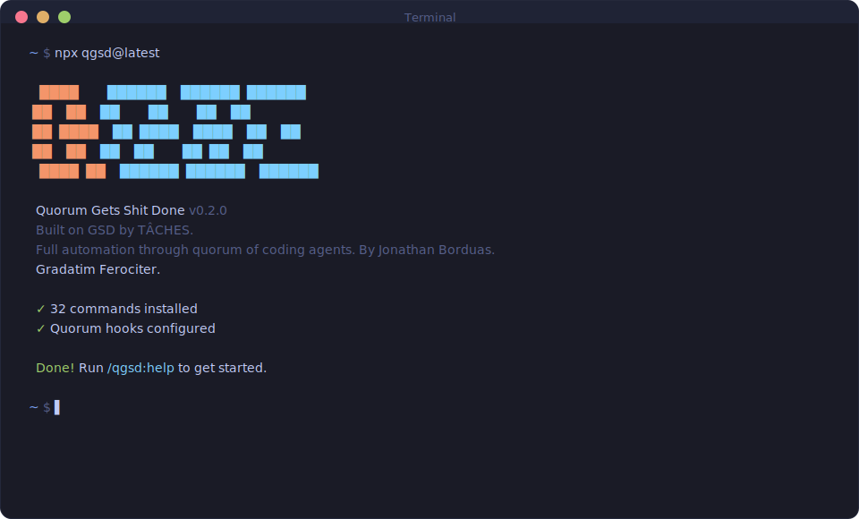

<div align="center">

# QGSD: Quorum Gets Shit Done

**Every planning decision verified by a quorum of AI models before Claude executes a single line.**

[](https://www.npmjs.com/package/qgsd)
[](https://www.npmjs.com/package/qgsd)
[](https://discord.com/servers/1474810068636663886)
[](https://x.com/JonathanBorduas)
[](https://github.com/LangBlaze-AI/QGSD)
[](LICENSE)

<br>

```bash
npx qgsd@latest
```

**Works on Mac, Windows, and Linux.**

<br>



<br>

[Why I Built QGSD](#why-i-built-qgsd) · [How It Works](#how-it-works) · [Commands](#commands) · [Why It Works](#why-it-works) · [User Guide](docs/USER-GUIDE.md)

</div>

---

## Why I Built QGSD

GSD nailed the workflow. But I wanted to push it further.

I believe diverse AI agents — running on diverse models — bring meaningfully different knowledge, reasoning patterns, and instincts to any given problem. Claude is extraordinary. But Gemini sees different things. Codex catches different edge cases. OpenCode and Copilot have different priors. That diversity, when structured properly, produces better strategies than any single model running alone — even the strongest one available.

So I forked GSD and built a multi-model quorum layer on top of it. Every planning decision, every research output, every roadmap — reviewed by five models before Claude executes a single line. Not as a committee to slow things down, but as a structured deliberation to surface blind spots.

The deeper goal: the first truly autonomous coding agent that only escalates to a human when there's a genuine lack of consensus. Not when it's uncertain. Not when it's guessing. Only when the quorum, after deliberation, can't agree — because that's the signal that a human judgment call is actually needed.

— **Jonathan Borduas**

---

## Who This Is For

People who want to describe what they want and have it built correctly — with a system that challenges its own assumptions before writing a single line of code.

---

## Getting Started

```bash
npx qgsd@latest
```

The installer prompts you to choose:
1. **Runtime** — Claude Code, OpenCode, Gemini, or all
2. **Location** — Global (all projects) or local (current project only)

Verify with `/qgsd:help` inside your chosen runtime.

### Setting Up Your Quorum

The fastest path is the interactive wizard — it handles everything from installing CLI tools to registering MCP servers and configuring API keys:

```
/qgsd:mcp-setup
```

**First run:** linear onboarding — picks provider, configures API key (stored in system keychain), registers MCP server with Claude Code, verifies live connectivity via identity ping.

**Re-run:** navigable agent menu — reconfigure any agent's key, provider, model, or toggle which agents participate in quorum (composition screen).

<details>
<summary><strong>Manual setup (advanced)</strong></summary>

QGSD's quorum requires each model to run as an MCP server inside Claude Code. This is a **one-time setup per machine** — three steps per model: install the CLI, authenticate, register with Claude Code.

QGSD uses a **slot-based naming scheme** (`<family>-<N>`) so you can run multiple instances of the same agent family. `claude-1` is the first Claude slot, `copilot-1` is the first Copilot slot, etc. Adding a second Copilot would be `copilot-2`.

---

#### OpenAI Codex — [codex-mcp-server](https://github.com/LangBlaze-AI/codex-mcp-server)

```bash
# 1. Install Codex CLI (v0.75.0+)
npm i -g @openai/codex

# 2. Authenticate
codex login --api-key "your-openai-api-key"

# 3. Register with Claude Code
claude mcp add codex-cli-1 -- npx -y codex-mcp-server
```

---

#### Google Gemini — [gemini-mcp-server](https://github.com/LangBlaze-AI/gemini-mcp-server)

```bash
# 1. Install Gemini CLI
npm install -g @google/gemini-cli

# 2. Authenticate (free tier: 60 req/min, 1000 req/day)
gemini  # follow the Google login flow

# 3. Register with Claude Code
claude mcp add gemini-cli-1 -- npx -y gemini-mcp-server
```

---

#### OpenCode — [opencode-mcp-server](https://github.com/LangBlaze-AI/opencode-mcp-server)

```bash
# 1. Install OpenCode CLI
npm install -g opencode-ai

# 2. Authenticate
opencode  # follow the auth flow

# 3. Register with Claude Code
claude mcp add opencode-1 -- npx -y opencode-mcp-server
```

---

#### GitHub Copilot — [copilot-mcp-server](https://github.com/LangBlaze-AI/copilot-mcp-server)

```bash
# 1. Requires an active GitHub Copilot subscription
#    Authenticate via GitHub CLI if not already done:
gh auth login

# 2. Register with Claude Code
claude mcp add copilot-1 -- npx -y copilot-mcp-server
```

---

#### Claude MCP — [claude-mcp-server](https://github.com/LangBlaze-AI/claude-mcp-server)

```bash
# Register with Claude Code (API key configured via /qgsd:mcp-setup)
claude mcp add claude-1 -- npx -y claude-mcp-server
```

---

#### After adding MCPs — refresh QGSD's detection

QGSD auto-detects your MCP server names on install and caches the result. After adding or renaming any MCP server, re-run with `--redetect-mcps` to update the cache:

```bash
npx qgsd@latest --redetect-mcps
```

This re-reads `~/.claude.json`, re-derives tool prefixes from your registered servers, and rewrites `~/.claude/qgsd.json`. Without this step, QGSD's hooks may reference stale default prefixes.

</details>

> [!NOTE]
> QGSD works with as few as one quorum member — more models means stronger consensus. Claude is always the fifth voting member in every quorum round.

### Staying Updated

QGSD evolves fast. Update periodically:

```bash
npx qgsd@latest
```

<details>
<summary><strong>Non-interactive Install (Docker, CI, Scripts)</strong></summary>

```bash
# Claude Code
npx qgsd --claude --global   # Install to ~/.claude/
npx qgsd --claude --local    # Install to ./.claude/

# OpenCode (open source, free models)
npx qgsd --opencode --global # Install to ~/.config/opencode/

# Gemini CLI
npx qgsd --gemini --global   # Install to ~/.gemini/

# All runtimes
npx qgsd --all --global      # Install to all directories
```

Use `--global` (`-g`) or `--local` (`-l`) to skip the location prompt.
Use `--claude`, `--opencode`, `--gemini`, or `--all` to skip the runtime prompt.

</details>

<details>
<summary><strong>Development Installation</strong></summary>

Clone the repository and run the installer locally:

```bash
git clone https://github.com/LangBlaze-AI/QGSD.git
cd QGSD
node bin/install.js --claude --local
```

Installs to `./.claude/` for testing modifications before contributing.

</details>

### Recommended: Skip Permissions Mode

QGSD is designed for frictionless automation. Run Claude Code with:

```bash
claude --dangerously-skip-permissions
```

> [!TIP]
> This is how QGSD is intended to be used — stopping to approve `date` and `git commit` 50 times defeats the purpose.

<details>
<summary><strong>Alternative: Granular Permissions</strong></summary>

If you prefer not to use that flag, add this to your project's `.claude/settings.json`:

```json
{
  "permissions": {
    "allow": [
      "Bash(date:*)",
      "Bash(echo:*)",
      "Bash(cat:*)",
      "Bash(ls:*)",
      "Bash(mkdir:*)",
      "Bash(wc:*)",
      "Bash(head:*)",
      "Bash(tail:*)",
      "Bash(sort:*)",
      "Bash(grep:*)",
      "Bash(tr:*)",
      "Bash(git add:*)",
      "Bash(git commit:*)",
      "Bash(git status:*)",
      "Bash(git log:*)",
      "Bash(git diff:*)",
      "Bash(git tag:*)"
    ]
  }
}
```

</details>

---

## How It Works

> **Already have code?** Run `/qgsd:map-codebase` first. It spawns parallel agents to analyze your stack, architecture, conventions, and concerns. Then `/qgsd:new-project` knows your codebase — questions focus on what you're adding, and planning automatically loads your patterns.

### 1. Initialize Project

```
/qgsd:new-project
```

One command, one flow. The system:

1. **Questions** — Asks until it understands your idea completely (goals, constraints, tech preferences, edge cases)
2. **Research** — Spawns parallel agents to investigate the domain (optional but recommended)
3. **Requirements** — Extracts what's v1, v2, and out of scope
4. **Roadmap** — Creates phases mapped to requirements

You approve the roadmap. Now you're ready to build.

**Creates:** `PROJECT.md`, `REQUIREMENTS.md`, `ROADMAP.md`, `STATE.md`, `.planning/research/`

---

### 2. Discuss Phase

```
/qgsd:discuss-phase 1
```

**This is where you shape the implementation.**

Your roadmap has a sentence or two per phase. That's not enough context to build something the way *you* imagine it. This step captures your preferences before anything gets researched or planned.

The system analyzes the phase and identifies gray areas based on what's being built:

- **Visual features** → Layout, density, interactions, empty states
- **APIs/CLIs** → Response format, flags, error handling, verbosity
- **Content systems** → Structure, tone, depth, flow
- **Organization tasks** → Grouping criteria, naming, duplicates, exceptions

For each area you select, it asks until you're satisfied. The output — `CONTEXT.md` — feeds directly into the next two steps:

1. **Researcher reads it** — Knows what patterns to investigate ("user wants card layout" → research card component libraries)
2. **Planner reads it** — Knows what decisions are locked ("infinite scroll decided" → plan includes scroll handling)

The deeper you go here, the more the system builds what you actually want. Skip it and you get reasonable defaults. Use it and you get *your* vision.

**Creates:** `{phase_num}-CONTEXT.md`

---

### 3. Plan Phase

```
/qgsd:plan-phase 1
```

The system:

1. **Researches** — Investigates how to implement this phase, guided by your CONTEXT.md decisions
2. **Plans** — Creates 2-3 atomic task plans with XML structure
3. **Verifies** — Checks plans against requirements, loops until they pass

Each plan is small enough to execute in a fresh context window. No degradation, no "I'll be more concise now."

**Creates:** `{phase_num}-RESEARCH.md`, `{phase_num}-{N}-PLAN.md`

---

### 4. Execute Phase

```
/qgsd:execute-phase 1
```

The system:

1. **Runs plans in waves** — Parallel where possible, sequential when dependent
2. **Fresh context per plan** — 200k tokens purely for implementation, zero accumulated garbage
3. **Commits per task** — Every task gets its own atomic commit
4. **Verifies against goals** — Checks the codebase delivers what the phase promised

Walk away, come back to completed work with clean git history.

**How Wave Execution Works:**

Plans are grouped into "waves" based on dependencies. Within each wave, plans run in parallel. Waves run sequentially.

```
┌─────────────────────────────────────────────────────────────────────┐
│  PHASE EXECUTION                                                     │
├─────────────────────────────────────────────────────────────────────┤
│                                                                      │
│  WAVE 1 (parallel)          WAVE 2 (parallel)          WAVE 3       │
│  ┌─────────┐ ┌─────────┐    ┌─────────┐ ┌─────────┐    ┌─────────┐ │
│  │ Plan 01 │ │ Plan 02 │ →  │ Plan 03 │ │ Plan 04 │ →  │ Plan 05 │ │
│  │         │ │         │    │         │ │         │    │         │ │
│  │ User    │ │ Product │    │ Orders  │ │ Cart    │    │ Checkout│ │
│  │ Model   │ │ Model   │    │ API     │ │ API     │    │ UI      │ │
│  └─────────┘ └─────────┘    └─────────┘ └─────────┘    └─────────┘ │
│       │           │              ↑           ↑              ↑       │
│       └───────────┴──────────────┴───────────┘              │       │
│              Dependencies: Plan 03 needs Plan 01            │       │
│                          Plan 04 needs Plan 02              │       │
│                          Plan 05 needs Plans 03 + 04        │       │
│                                                                      │
└─────────────────────────────────────────────────────────────────────┘
```

**Why waves matter:**
- Independent plans → Same wave → Run in parallel
- Dependent plans → Later wave → Wait for dependencies
- File conflicts → Sequential plans or same plan

This is why "vertical slices" (Plan 01: User feature end-to-end) parallelize better than "horizontal layers" (Plan 01: All models, Plan 02: All APIs).

**Creates:** `{phase_num}-{N}-SUMMARY.md`, `{phase_num}-VERIFICATION.md`

---

### 5. Verify Work

```
/qgsd:verify-work 1
```

**This is where you confirm it actually works.**

Automated verification checks that code exists and tests pass. But does the feature *work* the way you expected? This is your chance to use it.

The system:

1. **Extracts testable deliverables** — What you should be able to do now
2. **Walks you through one at a time** — "Can you log in with email?" Yes/no, or describe what's wrong
3. **Diagnoses failures automatically** — Spawns debug agents to find root causes
4. **Creates verified fix plans** — Ready for immediate re-execution

If everything passes, you move on. If something's broken, you don't manually debug — you just run `/qgsd:execute-phase` again with the fix plans it created.

**Creates:** `{phase_num}-UAT.md`, fix plans if issues found

---

### 6. Repeat → Complete → Next Milestone

```
/qgsd:discuss-phase 2
/qgsd:plan-phase 2
/qgsd:execute-phase 2
/qgsd:verify-work 2
...
/qgsd:complete-milestone
/qgsd:new-milestone
```

Loop **discuss → plan → execute → verify** until milestone complete.

Each phase gets your input (discuss), proper research (plan), clean execution (execute), and human verification (verify). Context stays fresh. Quality stays high.

When all phases are done, `/qgsd:complete-milestone` archives the milestone and tags the release.

Then `/qgsd:new-milestone` starts the next version — same flow as `new-project` but for your existing codebase. You describe what you want to build next, the system researches the domain, you scope requirements, and it creates a fresh roadmap. Each milestone is a clean cycle: define → build → ship.

---

### Quick Mode

```
/qgsd:quick
```

**For ad-hoc tasks that don't need full planning.**

Quick mode gives you QGSD guarantees (atomic commits, state tracking) with a faster path:

- **Same agents** — Planner + executor, same quality
- **Skips optional steps** — No research, no plan checker, no verifier
- **Separate tracking** — Lives in `.planning/quick/`, not phases

Use for: bug fixes, small features, config changes, one-off tasks.

```
/qgsd:quick
> What do you want to do? "Add dark mode toggle to settings"
```

**Creates:** `.planning/quick/001-add-dark-mode-toggle/PLAN.md`, `SUMMARY.md`

---

### Test Suite Maintenance

```
/qgsd:fix-tests
```

An autonomous command that discovers every test in your project, runs them, diagnoses failures, and dispatches fix tasks — looping until all tests are either passing or classified.

**How it works:**

1. **Discover** — Framework-native discovery (Jest, Playwright, pytest); never globs
2. **Batch & run** — Random batch order with flakiness detection (runs each batch twice)
3. **Categorize** — AI classifies each failure into one of 5 types:
   - `valid-skip` — Test is intentionally skipped; no action needed
   - `adapt` — Test broke because code changed; links to the causative commit via git pickaxe
   - `isolate` — Test only fails alongside specific other tests (pollution); ddmin algorithm finds the minimal polluter set
   - `real-bug` — Genuine regression; deferred to user report
   - `fixture` — Missing test data or environment setup
4. **Dispatch** — `adapt`, `fixture`, and `isolate` failures are dispatched as `/qgsd:quick` fix tasks automatically
5. **Loop** — Repeats until all tests pass or no progress for 5 consecutive batches

Interrupted runs resume to the exact batch step via `/qgsd:resume-work`.

---

## Why It Works

### Context Engineering

Claude Code is incredibly powerful *if* you give it the context it needs. Most people don't.

QGSD handles it for you:

| File | What it does |
|------|--------------|
| `PROJECT.md` | Project vision, always loaded |
| `research/` | Ecosystem knowledge (stack, features, architecture, pitfalls) |
| `REQUIREMENTS.md` | Scoped v1/v2 requirements with phase traceability |
| `ROADMAP.md` | Where you're going, what's done |
| `STATE.md` | Decisions, blockers, position — memory across sessions |
| `PLAN.md` | Atomic task with XML structure, verification steps |
| `SUMMARY.md` | What happened, what changed, committed to history |
| `todos/` | Captured ideas and tasks for later work |

Size limits based on where Claude's quality degrades. Stay under, get consistent excellence.

### XML Prompt Formatting

Every plan is structured XML optimized for Claude:

```xml
<task type="auto">
  <name>Create login endpoint</name>
  <files>src/app/api/auth/login/route.ts</files>
  <action>
    Use jose for JWT (not jsonwebtoken - CommonJS issues).
    Validate credentials against users table.
    Return httpOnly cookie on success.
  </action>
  <verify>curl -X POST localhost:3000/api/auth/login returns 200 + Set-Cookie</verify>
  <done>Valid credentials return cookie, invalid return 401</done>
</task>
```

Precise instructions. No guessing. Verification built in.

### Multi-Agent Orchestration

Every stage uses the same pattern: a thin orchestrator spawns specialized agents, collects results, and routes to the next step.

| Stage | Orchestrator does | Agents do |
|-------|------------------|-----------|
| Research | Coordinates, presents findings | 4 parallel researchers investigate stack, features, architecture, pitfalls |
| Planning | Validates, manages iteration | Planner creates plans, checker verifies, loop until pass |
| Execution | Groups into waves, tracks progress | Executors implement in parallel, each with fresh 200k context |
| Verification | Presents results, routes next | Verifier checks codebase against goals, debuggers diagnose failures |

The orchestrator never does heavy lifting. It spawns agents, waits, integrates results.

**The result:** You can run an entire phase — deep research, multiple plans created and verified, thousands of lines of code written across parallel executors, automated verification against goals — and your main context window stays at 30-40%. The work happens in fresh subagent contexts. Your session stays fast and responsive.

### Ping-Pong Commit Loop Breaker

**The problem no one talks about:** AI agents get stuck in ping-pong commit loops.

Not randomly. In a specific, predictable way. A bug exists at the boundary between two components — a contract mismatch, a shared assumption that's subtly wrong. The agent fixes the symptom in file A. That shifts the pressure to file B. The agent fixes file B. That breaks file A again. Repeat.

Each individual fix is locally correct. The agent is reasoning well about the immediate problem. But it's applying a **local fix to a global problem** — and no amount of trying harder at the local level solves a structural coupling issue.

```text
Agent fixes file A  →  File B breaks  →  Agent fixes file B  →  File A breaks
       ↑                                                               |
       └───────────────────────────────────────────────────────────────┘
                        The loop runs indefinitely
```

This isn't a hypothetical. It happens in production. It wastes hours. And it leaves your git history looking like:

```text
fix: correct auth token handling        ← file A
fix: fix session expiry logic           ← file B
fix: auth token was wrong               ← file A again
fix: session expiry broke again         ← file B again
```

**What QGSD does about it:**

QGSD's circuit breaker watches your git history for exactly this pattern. It collapses consecutive commits on the same file set into run-groups, then flags when the same file set alternates across 3+ run-groups. That's the structural signal: not "these files changed a lot," but "these files are ping-ponging."

When the pattern is detected, a Haiku reviewer first checks whether this is genuine oscillation or normal iterative refinement (polishing the same files toward a clear goal). If it's genuine, the circuit breaker fires.

**When the breaker fires:**

All write commands are blocked. Read-only commands (git log, diff, grep) remain available. The system doesn't just stop — it activates **Oscillation Resolution Mode**:

1. **Build the commit graph** — Makes the A→B→A→B ping-pong visually obvious
2. **Quorum diagnosis** — Every available model diagnoses the *structural coupling* causing both sides to oscillate — not the surface symptom
3. **Unified solution required** — Partial or incremental fixes are explicitly rejected. The quorum must propose a single change that resolves both sides simultaneously
4. **User approval gate** — No code runs until you approve the plan *and* run `npx qgsd --reset-breaker`

The key constraint in the resolution prompt: *"Diagnose the structural coupling — not the surface symptoms. Propose a unified solution. Partial fixes are not acceptable."*

This is the difference between a local fix and a global fix. A local fix patches the symptom. A global fix identifies why the two components are structurally coupled in a way that makes each fix shift the problem elsewhere — then eliminates the coupling.

```bash
# After approving the unified fix and committing it:
npx qgsd --reset-breaker

# For deliberate iterative work (temporary):
npx qgsd --disable-breaker
npx qgsd --enable-breaker
```

---

### Atomic Git Commits

Each task gets its own commit immediately after completion:

```bash
abc123f docs(08-02): complete user registration plan
def456g feat(08-02): add email confirmation flow
hij789k feat(08-02): implement password hashing
lmn012o feat(08-02): create registration endpoint
```

> [!NOTE]
> **Benefits:** Git bisect finds exact failing task. Each task independently revertable. Clear history for Claude in future sessions. Better observability in AI-automated workflow.

Every commit is surgical, traceable, and meaningful.

### Modular by Design

- Add phases to current milestone
- Insert urgent work between phases
- Complete milestones and start fresh
- Adjust plans without rebuilding everything

You're never locked in. The system adapts.

---

## Commands

### Core Workflow

| Command | What it does |
|---------|--------------|
| `/qgsd:new-project [--auto]` | Full initialization: questions → research → requirements → roadmap |
| `/qgsd:discuss-phase [N] [--auto]` | Capture implementation decisions before planning |
| `/qgsd:plan-phase [N] [--auto]` | Research + plan + verify for a phase |
| `/qgsd:execute-phase <N>` | Execute all plans in parallel waves, verify when complete |
| `/qgsd:verify-work [N]` | Manual user acceptance testing |
| `/qgsd:audit-milestone` | Verify milestone achieved its definition of done |
| `/qgsd:complete-milestone` | Archive milestone, tag release |
| `/qgsd:new-milestone [name]` | Start next version: questions → research → requirements → roadmap |

### Navigation

| Command | What it does |
|---------|--------------|
| `/qgsd:progress` | Where am I? What's next? |
| `/qgsd:help` | Show all commands and usage guide |
| `/qgsd:update` | Update QGSD with changelog preview |
| `/qgsd:join-discord` | Join the QGSD Discord community |

### Brownfield

| Command | What it does |
|---------|--------------|
| `/qgsd:map-codebase` | Analyze existing codebase before new-project |

### Phase Management

| Command | What it does |
|---------|--------------|
| `/qgsd:add-phase` | Append phase to roadmap |
| `/qgsd:insert-phase [N]` | Insert urgent work between phases |
| `/qgsd:remove-phase [N]` | Remove future phase, renumber |
| `/qgsd:research-phase [N]` | Deep ecosystem research only (usually prefer plan-phase) |
| `/qgsd:list-phase-assumptions [N]` | See Claude's intended approach before planning |
| `/qgsd:plan-milestone-gaps` | Create phases to close gaps from audit |
| `/qgsd:cleanup` | Archive completed phase directories |

### Session

| Command | What it does |
|---------|--------------|
| `/qgsd:pause-work` | Create handoff when stopping mid-phase |
| `/qgsd:resume-work` | Restore from last session |

### MCP Management

| Command | What it does |
|---------|--------------|
| `/qgsd:mcp-setup` | Interactive wizard: first-run onboarding or reconfigure any agent (key, provider, model, composition) |
| `/qgsd:mcp-status` | Poll all quorum agents for identity and availability; show scoreboard |
| `/qgsd:mcp-set-model <agent> <model>` | Switch a quorum agent's model with live validation and preference persistence |
| `/qgsd:mcp-update` | Update all quorum agent MCP servers (npm/npx/git install methods auto-detected) |
| `/qgsd:mcp-restart` | Restart all quorum agent processes and verify reconnection via identity ping |

### Test Maintenance

| Command | What it does |
|---------|--------------|
| `/qgsd:fix-tests` | Discover all tests, AI-categorize failures into 5 types, dispatch fixes, loop until clean |

### Utilities

| Command | What it does |
|---------|--------------|
| `/qgsd:settings` | Configure model profile and workflow agents |
| `/qgsd:set-profile <profile>` | Switch model profile (quality/balanced/budget) |
| `/qgsd:add-todo [desc]` | Capture idea for later |
| `/qgsd:check-todos` | List pending todos |
| `/qgsd:debug [desc]` | Start a debugging session with persistent state: spawns quorum diagnosis on failure, tracks hypotheses across invocations, resumes where it left off |
| `/qgsd:quorum-test` | Run multi-model quorum on a plan or verification artifact |
| `/qgsd:quorum [question]` | Ask a question and get full five-model consensus answer |
| `/qgsd:quick [--full]` | Execute ad-hoc task with QGSD guarantees (`--full` adds plan-checking and verification) |
| `/qgsd:reapply-patches` | Restore local modifications after an update |
| `/qgsd:health [--repair]` | Validate `.planning/` directory integrity, auto-repair with `--repair` |

---

## Configuration

QGSD stores project settings in `.planning/config.json`. Configure during `/qgsd:new-project` or update later with `/qgsd:settings`. For the full config schema, workflow toggles, git branching options, and per-agent model breakdown, see the [User Guide](docs/USER-GUIDE.md#configuration-reference).

### Core Settings

| Setting | Options | Default | What it controls |
|---------|---------|---------|------------------|
| `mode` | `yolo`, `interactive` | `interactive` | Auto-approve vs confirm at each step |
| `depth` | `quick`, `standard`, `comprehensive` | `standard` | Planning thoroughness (phases × plans) |

### Model Profiles

Control which Claude model each agent uses. Balance quality vs token spend.

| Profile | Planning | Execution | Verification |
|---------|----------|-----------|--------------|
| `quality` | Opus | Opus | Sonnet |
| `balanced` (default) | Opus | Sonnet | Sonnet |
| `budget` | Sonnet | Sonnet | Haiku |

Switch profiles:
```
/qgsd:set-profile budget
```

Or configure via `/qgsd:settings`.

### Workflow Agents

These spawn additional agents during planning/execution. They improve quality but add tokens and time.

| Setting | Default | What it does |
|---------|---------|--------------|
| `workflow.research` | `true` | Researches domain before planning each phase |
| `workflow.plan_check` | `true` | Verifies plans achieve phase goals before execution |
| `workflow.verifier` | `true` | Confirms must-haves were delivered after execution |
| `workflow.auto_advance` | `false` | Auto-chain discuss → plan → execute without stopping |

Use `/qgsd:settings` to toggle these, or override per-invocation:
- `/qgsd:plan-phase --skip-research`
- `/qgsd:plan-phase --skip-verify`

### Execution

| Setting | Default | What it controls |
|---------|---------|------------------|
| `parallelization.enabled` | `true` | Run independent plans simultaneously |
| `planning.commit_docs` | `true` | Track `.planning/` in git |

### Git Branching

Control how QGSD handles branches during execution.

| Setting | Options | Default | What it does |
|---------|---------|---------|--------------|
| `git.branching_strategy` | `none`, `phase`, `milestone` | `none` | Branch creation strategy |
| `git.phase_branch_template` | string | `gsd/phase-{phase}-{slug}` | Template for phase branches |
| `git.milestone_branch_template` | string | `gsd/{milestone}-{slug}` | Template for milestone branches |

**Strategies:**
- **`none`** — Commits to current branch (default QGSD behavior)
- **`phase`** — Creates a branch per phase, merges at phase completion
- **`milestone`** — Creates one branch for entire milestone, merges at completion

At milestone completion, QGSD offers squash merge (recommended) or merge with history.

### Quorum Composition

Control which agent slots participate in quorum via `quorum_active` in your `qgsd.json`:

```json
{
  "quorum_active": ["claude-1", "gemini-cli-1", "copilot-1"]
}
```

This is auto-populated at install time based on your registered MCP servers. Toggle slots on/off via `/qgsd:mcp-setup` → "Edit Quorum Composition" without editing config files directly.

You can run multiple instances of the same agent family (multi-slot): `claude-1` and `claude-2` for two Claude agent slots, `copilot-1` and `copilot-2` for two Copilot slots, etc.

---

## Security

### Protecting Sensitive Files

QGSD's codebase mapping and analysis commands read files to understand your project. **Protect files containing secrets** by adding them to Claude Code's deny list:

1. Open Claude Code settings (`.claude/settings.json` or global)
2. Add sensitive file patterns to the deny list:

```json
{
  "permissions": {
    "deny": [
      "Read(.env)",
      "Read(.env.*)",
      "Read(**/secrets/*)",
      "Read(**/*credential*)",
      "Read(**/*.pem)",
      "Read(**/*.key)"
    ]
  }
}
```

This prevents Claude from reading these files entirely, regardless of what commands you run.

> [!IMPORTANT]
> QGSD includes built-in protections against committing secrets, but defense-in-depth is best practice. Deny read access to sensitive files as a first line of defense.

---

## Troubleshooting

**Commands not found after install?**
- Restart Claude Code to reload slash commands
- Verify files exist in `~/.claude/commands/qgsd/` (global) or `./.claude/commands/qgsd/` (local)

**Commands not working as expected?**
- Run `/qgsd:help` to verify installation
- Re-run `npx qgsd@latest` to reinstall

**Updating to the latest version?**
```bash
npx qgsd@latest
```

**Using Docker or containerized environments?**

If file reads fail with tilde paths (`~/.claude/...`), set `CLAUDE_CONFIG_DIR` before installing:
```bash
CLAUDE_CONFIG_DIR=/home/youruser/.claude npx qgsd@latest
```
This ensures absolute paths are used instead of `~` which may not expand correctly in containers.

### Uninstalling

To remove QGSD completely:

```bash
# Global installs
npx qgsd --claude --global --uninstall
npx qgsd --opencode --global --uninstall

# Local installs (current project)
npx qgsd --claude --local --uninstall
npx qgsd --opencode --local --uninstall
```

This removes all QGSD commands, agents, hooks, and settings while preserving your other configurations.

---

## Star History

<a href="https://star-history.com/#LangBlaze-AI/QGSD&Date">
 <picture>
   <source media="(prefers-color-scheme: dark)" srcset="https://api.star-history.com/svg?repos=LangBlaze-AI/QGSD&type=Date&theme=dark" />
   <source media="(prefers-color-scheme: light)" srcset="https://api.star-history.com/svg?repos=LangBlaze-AI/QGSD&type=Date" />
   
 </picture>
</a>

---

## License

MIT License. See [LICENSE](LICENSE) for details.

---

<div align="center">

*"The task of leadership is to create an alignment of strengths so strong that it makes the system's weaknesses irrelevant."*

— Peter Drucker

</div>
