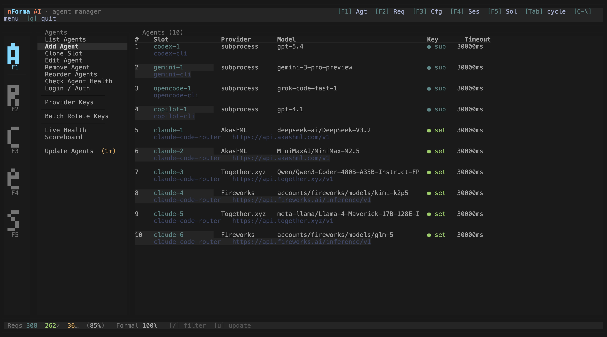
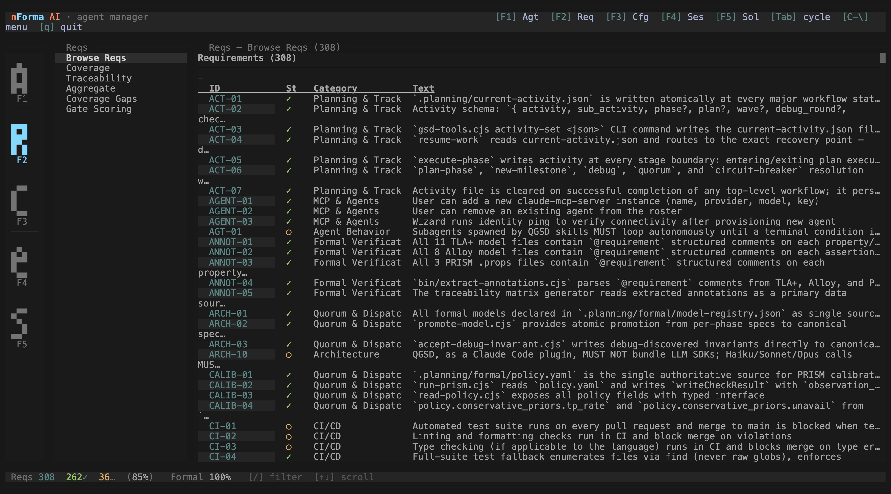
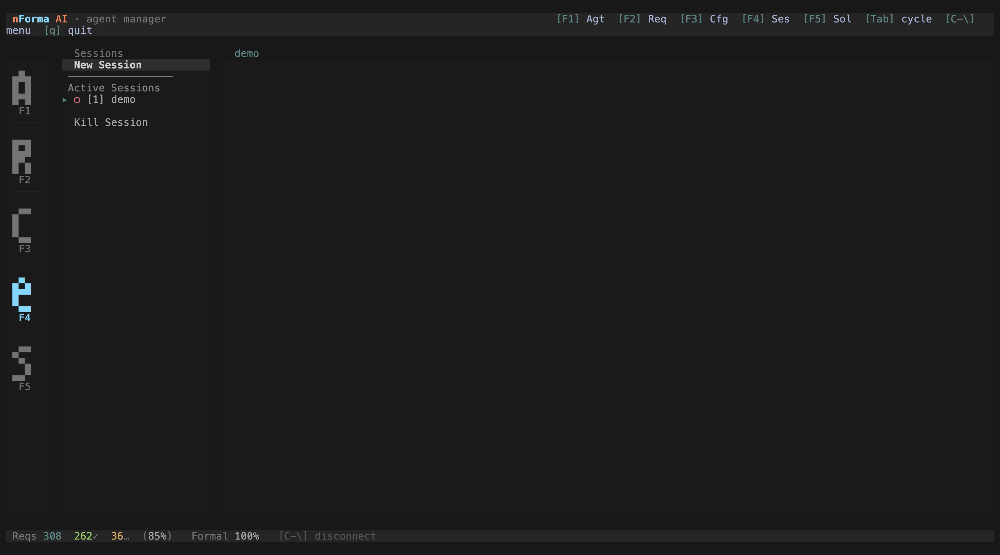
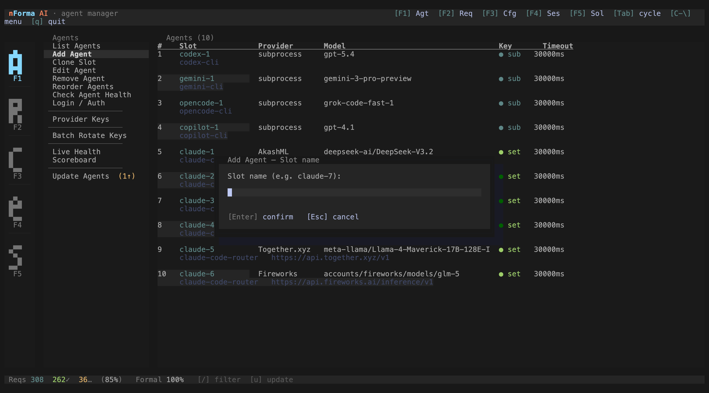
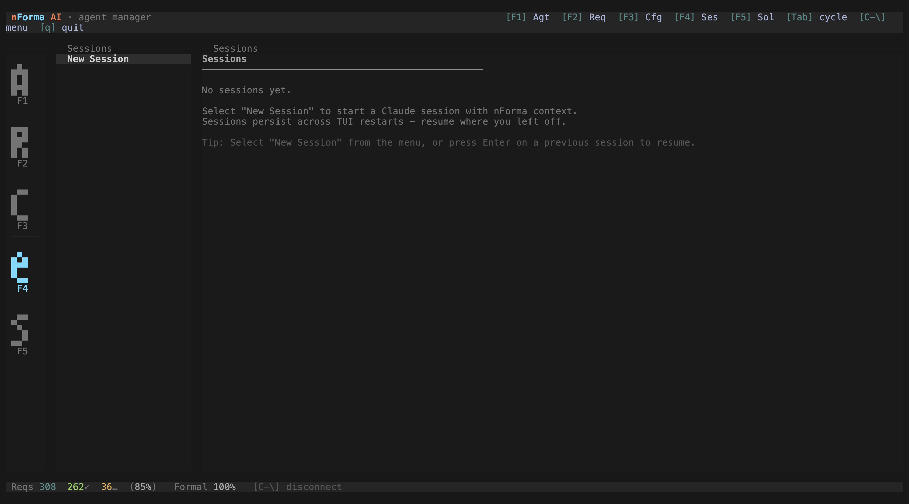

# nForma User Guide

A detailed reference for workflows, troubleshooting, and configuration. For quick-start setup, see the [README](../README.md).

---

## Table of Contents

- [Getting Started](#getting-started)
- [Workflow Diagrams](#workflow-diagrams)
- [Command Reference](#command-reference)
- [Configuration Reference](#configuration-reference)
- [Usage Examples](#usage-examples)
- [Troubleshooting](#troubleshooting)
- [Recovery Quick Reference](#recovery-quick-reference)
- [Project File Structure](#project-file-structure)

---

## Getting Started

This section walks you through installing nForma and running your first command. By the end, you will have a working quorum of AI models cross-checking each other's output.

### Step 1: Install nForma

Run the installer:

```bash
npx @nforma.ai/nforma@latest
```

The installer displays the nForma banner and prompts you to choose a runtime (Claude Code, OpenCode, Gemini, or all) and an install location (global or local). For first-time setup, select **Claude Code** and **Global** -- this installs nForma's hooks and workflows system-wide so every project can use them.


*The nForma installer banner with runtime and location prompts.*

### Step 2: Set Up Your Quorum

nForma uses multiple AI models to cross-check each other's work -- this group is called a **quorum**. Each model runs independently and votes on whether a plan or verification passes, catching errors that a single model would miss.

To configure your quorum's MCP (Model Context Protocol) servers, run:

```
/nf:mcp-setup
```

This opens a guided setup that connects nForma to your available AI providers. You will see a modal for adding each agent:



*The Add Agent modal lets you configure each quorum slot with a provider, API key, and model.*

Once your agents are configured, the Agent Manager shows all active quorum slots and their health status:


*The Agent Manager displays your configured quorum slots with connectivity status and model details.*

### Step 3: Your First Command

With nForma installed and your quorum configured, run your first real command:

```
/nf:new-project
```

nForma will ask you a series of questions about your project, then run parallel research agents, generate requirements, and produce a roadmap. For a smaller task, you can use `/nf:quick` instead.

The Requirements view shows what nForma produces -- a structured set of requirements with IDs, categories, and coverage tracking:



*The Requirements module tracks which requirements exist, their categories, and coverage status.*

### Step 4: Start a Project

Once your project is set up, you will work through phases using the lifecycle commands: `/nf:discuss-phase`, `/nf:plan-phase`, `/nf:execute-phase`, and `/nf:verify-work`. See [Usage Examples](#usage-examples) below for the full project lifecycle.

Here is what an active project session looks like, with project context and quorum status visible:



*An active Claude Code session managed by nForma, showing project context and quorum status.*

---

## Workflow Diagrams

### Full Project Lifecycle

```
  ┌──────────────────────────────────────────────────┐
  │                   NEW PROJECT                    │
  │  /nf:new-project                                │
  │  Questions -> Research -> Requirements -> Roadmap│
  └─────────────────────────┬────────────────────────┘
                            │
             ┌──────────────▼─────────────┐
             │      FOR EACH PHASE:       │
             │                            │
             │  ┌────────────────────┐    │
             │  │ /nf:discuss-phase │    │  <- Lock in preferences
             │  └──────────┬─────────┘    │
             │             │              │
             │  ┌──────────▼─────────┐    │
             │  │ /nf:plan-phase    │    │  <- Research + Plan + Verify
             │  └──────────┬─────────┘    │
             │             │              │
             │  ┌──────────▼─────────┐    │
             │  │ /nf:execute-phase │    │  <- Parallel execution
             │  └──────────┬─────────┘    │
             │             │              │
             │  ┌──────────▼─────────┐    │
             │  │ /nf:verify-work   │    │  <- Manual UAT
             │  └──────────┬─────────┘    │
             │             │              │
             │     Next Phase?────────────┘
             │             │ No
             └─────────────┼──────────────┘
                            │
            ┌───────────────▼──────────────┐
            │  /nf:audit-milestone        │
            │  /nf:complete-milestone     │
            └───────────────┬──────────────┘
                            │
                   Another milestone?
                       │          │
                      Yes         No -> Done!
                       │
               ┌───────▼──────────────┐
               │  /nf:new-milestone  │
               └──────────────────────┘
```

### Planning Agent Coordination

```
  /nf:plan-phase N
         │
         ├── Phase Researcher (x4 parallel)
         │     ├── Stack researcher
         │     ├── Features researcher
         │     ├── Architecture researcher
         │     └── Pitfalls researcher
         │           │
         │     ┌──────▼──────┐
         │     │ RESEARCH.md │
         │     └──────┬──────┘
         │            │
         │     ┌──────▼──────┐
         │     │   Planner   │  <- Reads PROJECT.md, REQUIREMENTS.md,
         │     │             │     CONTEXT.md, RESEARCH.md
         │     └──────┬──────┘
         │            │
         │     ┌──────▼───────────┐     ┌────────┐
         │     │   Plan Checker   │────>│ PASS?  │
         │     └──────────────────┘     └───┬────┘
         │                                  │
         │                             Yes  │  No
         │                              │   │   │
         │                              │   └───┘  (loop, up to 3x)
         │                              │
         │                        ┌─────▼──────┐
         │                        │ PLAN files │
         │                        └────────────┘
         └── Done
```


*The Requirements Coverage view tracks which requirements are addressed by which plans.*

### Execution Wave Coordination

```
  /nf:execute-phase N
         │
         ├── Analyze plan dependencies
         │
         ├── Wave 1 (independent plans):
         │     ├── Executor A (fresh 200K context) -> commit
         │     └── Executor B (fresh 200K context) -> commit
         │
         ├── Wave 2 (depends on Wave 1):
         │     └── Executor C (fresh 200K context) -> commit
         │
         └── For each plan step (checkpoint type handling):
               │
               ├── checkpoint:verify (automated gate)
               │     │
               │     └── /nf:quorum-test
               │           │
               │           ├── PASS -> continue execution
               │           │
               │           └── BLOCK/REVIEW-NEEDED
               │                 │
               │                 └── /nf:debug loop (max 3 rounds)
               │                       │
               │                       ├── Round N: fix -> re-run quorum-test
               │                       │     └── PASS -> continue execution
               │                       │
               │                       └── After 3 rounds, still failing
               │                             │
               │                             ▼
               └── checkpoint:human-verify (escalation only)
                     └── Human confirms before continuing
```

### Ping-Pong Commit Loop Breaker

```
  CIRCUIT BREAKER ACTIVE (PreToolUse deny)
         │
         │  Step 1: Extract from deny message
         ├── Oscillating file set
         └── commit_window_snapshot
                  │
                  ▼
         ┌────────────────────────────────────┐
         │  Step 2: Environmental Fast-Path   │
         │  Check (.env, *.config.*, lock     │
         │  files, schema files?)             │
         └────────────────┬───────────────────┘
                        │
               Yes      │      No
         ┌──────────────┘      └──────────────────┐
         │                                         │
         ▼                                         ▼
  ┌─────────────────┐                  Step 3: Build Commit Graph
  │ Immediate human │                  git log --oneline --name-only -N
  │ escalation      │                  Display as table (A→B→A pattern)
  │ (no quorum)     │                           │
  └─────────────────┘                           ▼
                                   ┌──────────────────────────┐
                                   │  Step 4: Quorum Diagnosis │
                                   │  STRUCTURAL COUPLING      │
                                   │  framing (R3.3 rules)     │
                                   │  Sequential tool calls    │
                                   │  Up to 4 rounds           │
                                   └──────────┬───────────────┘
                                              │
                              Consensus?      │
                         ┌──────────────┬─────┘
                        Yes             No (after 4 rounds)
                         │              │
                         ▼              ▼
               ┌─────────────────┐  ┌──────────────────────┐
               │ Step 5: Present │  │ Step 6: Hard-Stop     │
               │ unified solution│  │ Each model's position │
               │ Wait for user   │  │ Core disagreement     │
               │ approval        │  │ Claude's recommend.   │
               └────────┬────────┘  │ User makes final call │
                        │           └──────────────────────┘
               User approves
                        │
                        ▼
              Run: npx qgsd --reset-breaker
                        │
                        ▼
              Single-model executes
              (unified solution only —
               no incremental fixes)
```

### Brownfield Workflow (Existing Codebase)

```
  /nf:map-codebase
         │
         ├── Stack Mapper      -> codebase/STACK.md
         ├── Arch Mapper       -> codebase/ARCHITECTURE.md
         ├── Convention Mapper -> codebase/CONVENTIONS.md
         └── Concern Mapper    -> codebase/CONCERNS.md
                │
         [QUORUM VALIDATES]
         • Internal consistency across all 4 docs
         • Completeness & blind spots
         • Concern triage (blocks vs deferred)
                │
        ┌───────▼──────────┐
        │ /nf:new-project │  <- Questions focus on what you're ADDING
        └──────────────────┘
```

---

## Command Reference

<!-- @traces GUIDE-02 -->
nForma provides commands for the full project lifecycle, from initialization through milestone completion. The commands below are organized by category.



*The Agent Scoreboard shows quorum slot health, response times, and pass rates for each configured model.*

### Core Workflow

| Command | Purpose | When to Use |
|---------|---------|-------------|
| `/nf:new-project` | Full project init: questions, research, requirements, roadmap | Start of a new project |
| `/nf:new-project --auto @idea.md` | Automated init from document | Have a PRD or idea doc ready |
| `/nf:discuss-phase [N]` | Capture implementation decisions | Before planning, to shape how it gets built |
| `/nf:plan-phase [N]` | Research + plan + verify | Before executing a phase |
| `/nf:execute-phase <N>` | Execute all plans in parallel waves | After planning is complete |
| `/nf:verify-work [N]` | Manual UAT with auto-diagnosis | After execution completes |
| `/nf:audit-milestone` | Verify milestone met its definition of done | Before completing milestone |
| `/nf:complete-milestone` | Archive milestone, tag release | All phases verified |
| `/nf:new-milestone [name]` | Start next version cycle | After completing a milestone |

### Navigation

| Command | Purpose | When to Use |
|---------|---------|-------------|
| `/nf:progress` | Show status and next steps | Anytime -- "where am I?" |
| `/nf:resume-work` | Restore full context from last session | Starting a new session |
| `/nf:pause-work` | Save context handoff | Stopping mid-phase |
| `/nf:help` | Show all commands | Quick reference |
| `/nf:update` | Update nForma with changelog preview | Check for new versions |
| `/nf:join-discord` | Open Discord community invite | Questions or community |

### Phase Management

| Command | Purpose | When to Use |
|---------|---------|-------------|
| `/nf:add-phase` | Append new phase to roadmap | Scope grows after initial planning |
| `/nf:insert-phase [N]` | Insert urgent work (decimal numbering) | Urgent fix mid-milestone |
| `/nf:remove-phase [N]` | Remove future phase and renumber | Descoping a feature |
| `/nf:list-phase-assumptions [N]` | Preview Claude's intended approach | Before planning, to validate direction |
| `/nf:plan-milestone-gaps` | Create phases for audit gaps | After audit finds missing items |
| `/nf:research-phase [N]` | Deep ecosystem research only | Complex or unfamiliar domain |

### Brownfield & Utilities

| Command | Purpose | When to Use |
|---------|---------|-------------|
| `/nf:map-codebase` | Analyze existing codebase | Before `/nf:new-project` on existing code |
<!-- @traces PF-05 -->
| `/nf:quick` | Ad-hoc task with nForma guarantees | Bug fixes, small features, config changes |
| `/nf:debug [desc]` | Systematic debugging with persistent state | When something breaks |
| `/nf:triage [--source github\|sentry\|bash] [--since 24h\|7d] [--limit N]` | Fetch and prioritize issues from GitHub, Sentry, or custom sources | Route issues to nForma workflows |
| `/nf:queue <command>` | Queue a command to auto-invoke after the next /clear | Maintain task continuity across context compaction |
| `/nf:quorum-test` | Run multi-model quorum on a plan or verification artifact | During checkpoint:verify or manual plan review |
| `/nf:quorum [question]` | Ask a question and get full five-model consensus answer | Architectural decisions, design tradeoffs |
| `/nf:add-todo [desc]` | Capture an idea for later | Think of something during a session |
| `/nf:check-todos` | List pending todos | Review captured ideas |
| `/nf:settings` | Configure workflow toggles and model profile | Change model, toggle agents |
| `/nf:set-profile <profile>` | Quick profile switch | Change cost/quality tradeoff |
| `/nf:reapply-patches` | Restore local modifications after update | After `/nf:update` if you had local edits |

---

## Configuration Reference

nForma stores project settings in `.planning/config.json`. Configure during `/nf:new-project` or update later with `/nf:settings`.


*The TUI Config module lets you edit provider keys, timeouts, and export/import settings without touching JSON files.*

### Full config.json Schema

```json
{
  "mode": "interactive",
  "depth": "standard",
  "model_profile": "balanced",
  "planning": {
    "commit_docs": true,
    "search_gitignored": false
  },
  "workflow": {
    "research": true,
    "plan_check": true,
    "verifier": true
  },
  "git": {
    "branching_strategy": "none",
    "phase_branch_template": "gsd/phase-{phase}-{slug}",
    "milestone_branch_template": "gsd/{milestone}-{slug}"
  }
}
```

### Core Settings

| Setting | Options | Default | What it Controls |
|---------|---------|---------|------------------|
| `mode` | `interactive`, `yolo` | `interactive` | `yolo` auto-approves decisions; `interactive` confirms at each step |
| `depth` | `quick`, `standard`, `comprehensive` | `standard` | Planning thoroughness: 3-5, 5-8, or 8-12 phases |
| `model_profile` | `quality`, `balanced`, `budget` | `balanced` | Model tier for each agent (see table below) |

### Planning Settings

| Setting | Options | Default | What it Controls |
|---------|---------|---------|------------------|
| `planning.commit_docs` | `true`, `false` | `true` | Whether `.planning/` files are committed to git |
| `planning.search_gitignored` | `true`, `false` | `false` | Add `--no-ignore` to broad searches to include `.planning/` |

> **Note:** If `.planning/` is in `.gitignore`, `commit_docs` is automatically `false` regardless of the config value.

### Workflow Toggles

| Setting | Options | Default | What it Controls |
|---------|---------|---------|------------------|
| `workflow.research` | `true`, `false` | `true` | Domain investigation before planning |
| `workflow.plan_check` | `true`, `false` | `true` | Plan verification loop (up to 3 iterations) |
| `workflow.verifier` | `true`, `false` | `true` | Post-execution verification against phase goals |

Disable these to speed up phases in familiar domains or when conserving tokens.

### Git Branching

| Setting | Options | Default | What it Controls |
|---------|---------|---------|------------------|
| `git.branching_strategy` | `none`, `phase`, `milestone` | `none` | When and how branches are created |
| `git.phase_branch_template` | Template string | `gsd/phase-{phase}-{slug}` | Branch name for phase strategy |
| `git.milestone_branch_template` | Template string | `gsd/{milestone}-{slug}` | Branch name for milestone strategy |

**Branching strategies explained:**

| Strategy | Creates Branch | Scope | Best For |
|----------|---------------|-------|----------|
| `none` | Never | N/A | Solo development, simple projects |
| `phase` | At each `execute-phase` | One phase per branch | Code review per phase, granular rollback |
| `milestone` | At first `execute-phase` | All phases share one branch | Release branches, PR per version |

**Template variables:** `{phase}` = zero-padded number (e.g., "03"), `{slug}` = lowercase hyphenated name, `{milestone}` = version (e.g., "v1.0").

### Model Profiles (Per-Agent Breakdown)

| Agent | `quality` | `balanced` | `budget` |
|-------|-----------|------------|----------|
| qgsd-planner | Opus | Opus | Sonnet |
| qgsd-roadmapper | Opus | Sonnet | Sonnet |
| qgsd-executor | Opus | Sonnet | Sonnet |
| qgsd-phase-researcher | Opus | Sonnet | Haiku |
| qgsd-project-researcher | Opus | Sonnet | Haiku |
| qgsd-research-synthesizer | Sonnet | Sonnet | Haiku |
| qgsd-debugger | Opus | Sonnet | Sonnet |
| qgsd-codebase-mapper | Sonnet | Haiku | Haiku |
| qgsd-verifier | Sonnet | Sonnet | Haiku |
| qgsd-plan-checker | Sonnet | Sonnet | Haiku |
| qgsd-integration-checker | Sonnet | Sonnet | Haiku |

**Profile philosophy:**
- **quality** -- Opus for all decision-making agents, Sonnet for read-only verification. Use when quota is available and the work is critical.
- **balanced** -- Opus only for planning (where architecture decisions happen), Sonnet for everything else. The default for good reason.
- **budget** -- Sonnet for anything that writes code, Haiku for research and verification. Use for high-volume work or less critical phases.

---

## Usage Examples

### New Project (Full Cycle)

```bash
claude --dangerously-skip-permissions
/nf:new-project            # Answer questions, configure, approve roadmap
/clear
/nf:discuss-phase 1        # Lock in your preferences
/nf:plan-phase 1           # Research + plan + verify
/nf:execute-phase 1        # Parallel execution
/nf:verify-work 1          # Manual UAT
/clear
/nf:discuss-phase 2        # Repeat for each phase
...
/nf:audit-milestone        # Check everything shipped
/nf:complete-milestone     # Archive, tag, done
```

### New Project from Existing Document

```bash
/nf:new-project --auto @prd.md   # Auto-runs research/requirements/roadmap from your doc
/clear
/nf:discuss-phase 1               # Normal flow from here
```

### Existing Codebase

```bash
/nf:map-codebase           # Analyze what exists (parallel agents)
/nf:new-project            # Questions focus on what you're ADDING
# (normal phase workflow from here)
```

### Quick Bug Fix

```bash
/nf:quick
> "Fix the login button not responding on mobile Safari"
```

### Resuming After a Break

```bash
/nf:progress               # See where you left off and what's next
# or
/nf:resume-work            # Full context restoration from last session
```



*The Sessions module shows active and recent Claude Code sessions with context summaries.*

### Preparing for Release

```bash
/nf:audit-milestone        # Check requirements coverage, detect stubs
/nf:plan-milestone-gaps    # If audit found gaps, create phases to close them
/nf:complete-milestone     # Archive, tag, done
```

### Speed vs Quality Presets

| Scenario | Mode | Depth | Profile | Research | Plan Check | Verifier |
|----------|------|-------|---------|----------|------------|----------|
| Prototyping | `yolo` | `quick` | `budget` | off | off | off |
| Normal dev | `interactive` | `standard` | `balanced` | on | on | on |
| Production | `interactive` | `comprehensive` | `quality` | on | on | on |

### Mid-Milestone Scope Changes

```bash
/nf:add-phase              # Append a new phase to the roadmap
# or
/nf:insert-phase 3         # Insert urgent work between phases 3 and 4
# or
/nf:remove-phase 7         # Descope phase 7 and renumber
```

---

## Troubleshooting

When something goes wrong, the Solve module provides a diagnostic overview that surfaces formal verification gaps, circuit breaker state, and actionable next steps:


*The Solve module surfaces formal verification gaps, circuit breaker state, and actionable diagnostics.*

### "Project already initialized"

You ran `/nf:new-project` but `.planning/PROJECT.md` already exists. This is a safety check. If you want to start over, delete the `.planning/` directory first.

### Context Degradation During Long Sessions

Clear your context window between major commands: `/clear` in Claude Code. nForma is designed around fresh contexts -- every subagent gets a clean 200K window. If quality is dropping in the main session, clear and use `/nf:resume-work` or `/nf:progress` to restore state.

### Plans Seem Wrong or Misaligned

Run `/nf:discuss-phase [N]` before planning. Most plan quality issues come from Claude making assumptions that `CONTEXT.md` would have prevented. You can also run `/nf:list-phase-assumptions [N]` to see what Claude intends to do before committing to a plan.

### Execution Fails or Produces Stubs

Check that the plan was not too ambitious. Plans should have 2-3 tasks maximum. If tasks are too large, they exceed what a single context window can produce reliably. Re-plan with smaller scope.

### Lost Track of Where You Are

Run `/nf:progress`. It reads all state files and tells you exactly where you are and what to do next.

### Need to Change Something After Execution

Do not re-run `/nf:execute-phase`. Use `/nf:quick` for targeted fixes, or `/nf:verify-work` to systematically identify and fix issues through UAT.

### Model Costs Too High

Switch to budget profile: `/nf:set-profile budget`. Disable research and plan-check agents via `/nf:settings` if the domain is familiar to you (or to Claude).

### Working on a Sensitive/Private Project

Set `commit_docs: false` during `/nf:new-project` or via `/nf:settings`. Add `.planning/` to your `.gitignore`. Planning artifacts stay local and never touch git.

### nForma Update Overwrote My Local Changes

Since v1.17, the installer backs up locally modified files to `gsd-local-patches/`. Run `/nf:reapply-patches` to merge your changes back.

### Subagent Appears to Fail but Work Was Done

A known workaround exists for a Claude Code classification bug. nForma's orchestrators (execute-phase, quick) spot-check actual output before reporting failure. If you see a failure message but commits were made, check `git log` -- the work may have succeeded.

---

## Recovery Quick Reference

| Problem | Solution |
|---------|----------|
| Lost context / new session | `/nf:resume-work` or `/nf:progress` |
| Phase went wrong | `git revert` the phase commits, then re-plan |
| Need to change scope | `/nf:add-phase`, `/nf:insert-phase`, or `/nf:remove-phase` |
| Milestone audit found gaps | `/nf:plan-milestone-gaps` |
| Something broke | `/nf:debug "description"` |
| Quick targeted fix | `/nf:quick` |
| Plan doesn't match your vision | `/nf:discuss-phase [N]` then re-plan |
| Costs running high | `/nf:set-profile budget` and `/nf:settings` to toggle agents off |
| Update broke local changes | `/nf:reapply-patches` |

---

## Project File Structure

For reference, here is what nForma creates in your project:

```
.planning/
  PROJECT.md              # Project vision and context (always loaded)
  REQUIREMENTS.md         # Scoped v1/v2 requirements with IDs
  ROADMAP.md              # Phase breakdown with status tracking
  STATE.md                # Decisions, blockers, session memory
  config.json             # Workflow configuration
  MILESTONES.md           # Completed milestone archive
  research/               # Domain research from /nf:new-project
  todos/
    pending/              # Captured ideas awaiting work
    done/                 # Completed todos
  debug/                  # Active debug sessions
    resolved/             # Archived debug sessions
  codebase/               # Brownfield codebase mapping (from /nf:map-codebase)
  phases/
    XX-phase-name/
      XX-YY-PLAN.md       # Atomic execution plans
      XX-YY-SUMMARY.md    # Execution outcomes and decisions
      CONTEXT.md          # Your implementation preferences
      RESEARCH.md         # Ecosystem research findings
      VERIFICATION.md     # Post-execution verification results
```
